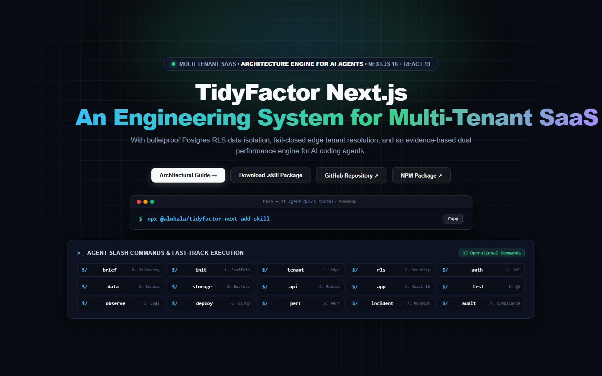
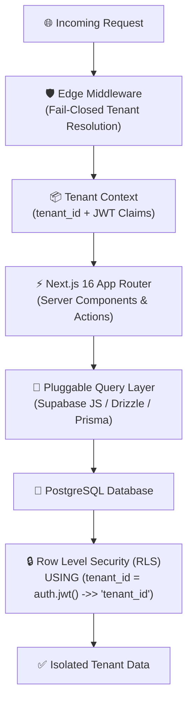
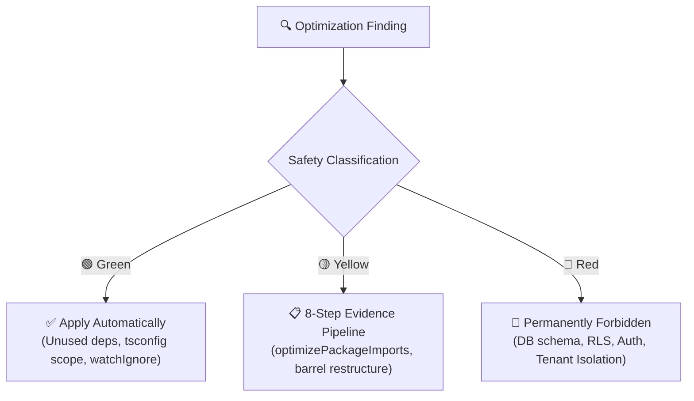

<div align="center" dir="rtl">

# ⚡ مهارة تايتفكتور لمعمارية ستارت أب `TidyFactor Next.js v1.3.0`
### مهارة المعمارية السحابية متعددة المستأجرين (Multi-Tenant SaaS) وتأمين البيانات ومحرك الأداء لوكلاء الذكاء الاصطناعي

امنح وكلاء البرمجة الذكية (**Google Antigravity و Claude Code و Cursor و OpenAI Codex و Windsurf**) معمارية أمنية محكمة لا تقبل التهاون على **Next.js 16 + React 19 + Supabase** — ليتوقف وكيلك عن ارتجال عزل المستأجرين ويبدأ في فرضه حتمياً.

[](https://www.npmjs.com/package/@alwkala/tidyfactor-next)
[](LICENSE)
[](#-نموذج-عزل-المستأجرين-الصارم-locked-tenant-isolation)
[](#-لماذا-tidyfactornext)
[-green.svg?style=for-the-badge)](#-منهجية-tidyfactor-وحوكمة-الامتثال)

[🚀 البدء السريع](#-البدء-السريع) • [🎯 لماذا TidyFactor/Next](#-لماذا-tidyfactornext) • [🔒 عزل المستأجرين](#-نموذج-عزل-المستأجرين-الصارم-locked-tenant-isolation) • [⚡ دورة حياة الأوامر الـ 15](#-دورة-حياة-أوامر-الساس-الـ-15-saas-command-lifecycle) • [🚀 محرك الأداء](#-محرك-الأداء-وتشخيص-الموارد) • [❓ الأسئلة الشائعة](#-الأسئلة-الشائعة-faq) • [📖 English Version](README.md)

<br/><br/>

<p align="center">
  
</p>

</div>

---

## 📚 جدول المحتويات

- [🎯 لماذا TidyFactor/Next](#-لماذا-tidyfactornext)
- [🚀 البدء السريع](#-البدء-السريع)
- [🌟 القيمة المعمارية المضافة](#-القيمة-المعمارية-المضافة)
- [🔒 نموذج عزل المستأجرين الصارم (Locked Tenant Isolation)](#-نموذج-عزل-المستأجرين-الصارم-locked-tenant-isolation)
- [⚡ دورة حياة أوامر الساس الـ 15 (SaaS Command Lifecycle)](#-دورة-حياة-أوامر-الساس-الـ-15-saas-command-lifecycle)
- [🚀 محرك الأداء وتشخيص الموارد (Performance Engine)](#-محرك-الأداء-وتشخيص-الموارد)
  - [1. مصفوفة قواعد أداء التشغيل من هندسة فرسل (8 طبقات ذات أولوية)](#1-مصفوفة-قواعد-أداء-التشغيل-من-هندسة-فرسل-8-طبقات-ذات-أولوية)
  - [2. نماذج تشخيص اختناقات بيئة التطوير الستة](#2-نماذج-تشخيص-اختناقات-بيئة-التطوير-الستة)
  - [3. مستويات أمان التحسين (الأخضر / الأصفر / الأحمر)](#3-مستويات-أمان-التحسين-الأخضر--الأصفر--الأحمر)
- [🛡️ مصفوفة سياسات RLS وخطافات JWT](#%EF%B8%8F-مصفوفة-سياسات-rls-وخطافات-jwt)
- [📋 ذاكرة المشروع التشغيلية وملف `ARCHITECTURE.md`](#-ذاكرة-المشروع-التشغيلية-وملف-architecturemd)
- [❓ الأسئلة الشائعة (FAQ)](#-الأسئلة-الشائعة-faq)
- [🏛️ منظومة تايدي فاكتور الشاملة (TidyFactor Ecosystem)](#%EF%B8%8F-منظومة-تايدي-فاكتور-الشاملة-tidyfactor-ecosystem)
- [🏛️ منهجية TidyFactor وحوكمة الامتثال](#%EF%B8%8F-منهجية-tidyfactor-وحوكمة-الامتثال)
- [🤝 المساهمة والتطوير المجتمعي](#-المساهمة-والتطوير-المجتمعي)
- [👨‍💻 قنوات الدعم والتواصل](#-قنوات-الدعم-والتواصل)
- [📜 الترخيص](#-الترخيص)

---

## 🎯 لماذا TidyFactor/Next

معظم مهارات Next.js لوكلاء الذكاء الاصطناعي تركز على كتابة كود قياسي — كاصطلاحات App Router وإدارة الكاش وتحسين حجم الحزم. هذا ضروري، لكنه **لا يمنع** الوكيل الذكي من كتابة استعلام يسرب بيانات الشركة (أ) إلى لوحة تحكم الشركة (ب).

**تعمل TidyFactor/Next على مستوى أعمق: إنها عقد معماري وأمني صارم وليست مجرد دليل لتنسيق الكود.**

| البُعد | مهارات Next.js العامة | `tidyfactor-next` |
|---|---|---|
| **ما تعلمه للوكيل** | اصطلاحات App Router، حدود RSC، إدارة الكاش | معمارية الساس متعدد المستأجرين + حاجز أمان Postgres RLS الصلب |
| **النطاق** | **أفقي واسع**: مقتطفات برمجية صغيرة عامة | **عمودي متخصص**: تخصص كامل في تطبيقات الـ SaaS من البداية للنهاية |
| **أخطاء تمنعها حتمياً** | بطء المكونات، أحجام حزم غير محسنة | تسريب بيانات المستأجرين ونسيان شروط `WHERE tenant_id = ...` |
| **نطاق الأداء** | نصائح أداء عامة لبيئة الإنتاج | **محرك مزدوج**: 8 طبقات أداء تشغيلي + 6 نماذج لتشخيص موارد بيئة التطوير |
| **درجة الامتثال المعماري** | غير محددة | **100% Architect Score** (تطابق كامل لقواعد حوكمة تايدي فاكتور) |
| **هل يمكن دمجهما معاً؟** | ✅ | ✅ — ثبّتهما معاً؛ فهما يكملان بعضهما بدقة |

> [!TIP]
> إذا كنت تبني تطبيق ساس (SaaS) حيث يعني تسريب البيانات بين المستأجرين مساءلة قانونية، فإن **`tidyfactor-next` هي طبقة الحماية الأساسية التي يحتاجها وكيلك الذكي** إلى جانب أفضل ممارسات رياكت العامة.

---

## 🚀 البدء السريع

### 1. المعالج التفاعلي والحقن المباشر

```bash
# المعالج التفاعلي لإنشاء منصة ساس جديدة معزولة
npx @alwkala/tidyfactor-next

# أو حقن المهارة مباشرة داخل مشروع Next.js قائم
npx @alwkala/tidyfactor-next add-skill
```

### 2. مسارات التثبيت اليدوي حسب بيئة الوكيل الذكي

| وكيل الذكاء الاصطناعي | مسار التثبيت في مساحة العمل |
|---|---|
| **Google Antigravity** | `.agents/skills/tidyfactor-next/` أو الإعدادات العامة `~/.gemini/config/skills/` |
| **Claude Code** | `.claude-skill/skills/tidyfactor-next/` |
| **Cursor / Codex / Windsurf** | `.agents/skills/tidyfactor-next/` |

بمجرد التثبيت، اكتب `/init` أو `/brief` داخل نافذة المحادثة مع الوكيل لاكتشاف اختيارات المشروع وتوليد ملف المعمارية الموحد `ARCHITECTURE.md`!

---

## 🌟 القيمة المعمارية المضافة



<p align="center">
  
</p>

| لمهندسي الفول ستاك | لمؤسسي الشركات والمدراء التقنيين | لوكلاء البرمجة الذكية (AI Agents) |
|---|---|---|
| **عزل مستأجرين محكم**: مخطط قاعدة بيانات مشترك مع `tenant_id` وسياسات RLS، دون تعقيدات تعدد قواعد البيانات وهجرة المخططات المنفصلة. | **ضمان عدم تسريب البيانات**: حاجز أمان صلب على مستوى قاعدة البيانات؛ أخطاء الكود البرمجي لا يمكنها كشف بيانات حساب لآخر. | **موجه أوامر فائق الخفة**: يستهلك موجه `SKILL.md` حوالي 350 توكن فقط عند البداية، ويستدعي الذاكرة التشغيلية عند الطلب فقط. |
| **طبقة استعلام مرنة**: اختر Supabase JS أو Drizzle ORM أو Prisma لمرة واحدة عند التهيئة، ويلتزم بها الكود المولد بالكامل. | **خطاف JWT مخصص على السيرفر**: حقن `tenant_id` وصلاحيات الدور داخل التوكن على السيرفر، وعدم الوثوق أبداً بمدخلات العميل. | **سير عمل حتمي**: ينفذ كل أمر قائمة تحقق صارمة (Validation Checklist) لضمان جودة المخرجات. |
| **حل الهوية الصارم (Fail-Closed)**: برمجيات الـ Edge الوسيطة تحل هوية المستأجر عبر النطاق الفرعي أو النطاق المخصص أو الجلسة، وتغلق الاتصال فوراً عند الخطأ (404/403). | **معمارية حرة دون قيود**: معايير قياسية على Next.js App Router و PostgreSQL دون الاعتماد على أدوات مغلقة المصدر. | **توافق كامل بنسبة 100%**: متوافقة مع القواعد الهيكلية لمنظومة TidyFactor Skill Architect. |
| **محرك أداء قائم على الأدلة**: تشخيص اختناقات الرام والمعالج والقرص قبل تعديل الكود، مع قياس الفروقات الحسابية (DELTA). | **تكاليف استضافة قابلة للتوقع**: كشف الحزم المتضخمة وتسريبات مفاتيح السيرفر قبل النشر. | **حدود أمان الساس الصارمة**: حظر تلقائي للتحسينات التي قد تضعف سياسات RLS أو عزل البيانات. |

---

## 🔒 نموذج عزل المستأجرين الصارم (Locked Tenant Isolation)

تفرض `tidyfactor-next` سياسات عزل صارمة غير قابلة للتهاون طوال دورة حياة المشروع:

```sql
-- سياسة عزل المستأجر القياسية (النمط 1)
ALTER TABLE public.organizations ENABLE ROW LEVEL SECURITY;

CREATE POLICY "organizations_tenant_isolation_select" ON public.organizations
  FOR SELECT USING (tenant_id = (auth.jwt() ->> 'tenant_id')::uuid);

CREATE POLICY "organizations_tenant_isolation_insert" ON public.organizations
  FOR INSERT WITH CHECK (tenant_id = (auth.jwt() ->> 'tenant_id')::uuid);

CREATE POLICY "organizations_tenant_isolation_update" ON public.organizations
  FOR UPDATE USING (tenant_id = (auth.jwt() ->> 'tenant_id')::uuid)
  WITH CHECK (tenant_id = (auth.jwt() ->> 'tenant_id')::uuid);

CREATE POLICY "organizations_tenant_isolation_delete" ON public.organizations
  FOR DELETE USING (tenant_id = (auth.jwt() ->> 'tenant_id')::uuid);
```

### 🚨 توجيهات الأمان غير القابلة للجدل:
1. **سياسات RLS هي حاجز الأمان الحقيقي**: وضع شرط `WHERE tenant_id = ...` في الكود هو مجرد تلميح لمحسن الاستعلامات. إذا تم تعطيل RLS، يعتبر النظام معيباً برمجياً.
2. **عزل مفتاح `service_role`**: ممنوع نهائياً من الوصول لمتصفح العميل أو الواجهات العامة. يستخدم فقط في خلفية السيرفر مع إعادة التحقق من سياق المستأجر.
3. **تمرير السياق من الـ Edge**: يتم حل هوية المستأجر مرة واحدة عند نقطة الدخول وتمريرها للأسفل، وتجنب إعادة استنتاجها عشوائياً في المكونات الداخلية.
4. **مراجعة العمليات العابرة للمستأجرين**: عمليات الدخول الإداري بالنيابة والتقارير العامة يتم عزلها واعتبارها نقاط تدقيق أمني حساسة.

---

## ⚡ دورة حياة أوامر الساس الـ 15 (SaaS Command Lifecycle)

تغطي المهارة كافة مراحل بناء منصات الساس عبر 15 أمراً تخصصياً مكتملاً بنسبة **100%**:

| المرحلة | الأمر | نية واستخدام الأمر | ما يتم تحميله في الذاكرة | الحالة |
|---|---|---|---|:---:|
| **0. الاكتشاف** | `brief` | المقابلة الاستكشافية وتثبيت الخيارات المعمارية في كاش المشروع | `references/workflows/brief.md` + `decision-points.md` + `quality-bar.md` | ✅ **مكتمل** |
| **1. التأسيس** | `init` | توليد مشروع ساس جديد وتوثيق المعمارية في `ARCHITECTURE.md` | `references/workflows/init.md` + `spec.md` + `architecture-doc-skeleton.md` | ✅ **مكتمل** |
| **1. التأسيس** | `tenant` | حل هوية المستأجرين وسياق الـ Edge ودورة حياتهم | `references/workflows/tenant.md` + `references/memory/spec.md` | ✅ **مكتمل** |
| **2. الأمان** | `rls` | كتابة سياسات RLS بنمط السياسات الأربعة وتدقيق التسريب | `references/workflows/rls.md` + `spec.md` + `rls-patterns.md` | ✅ **مكتمل** |
| **2. الأمان** | `auth` | ضبط المصادقة وخطاف JWT والصلاحيات (RBAC/ABAC) | `references/workflows/auth.md` + `spec.md` + `auth-patterns.md` | ✅ **مكتمل** |
| **3. البيانات** | `data` | المخططات والـ Migrations والمعاملات والقيود | `references/workflows/data.md` + `references/memory/decision-points.md` | ✅ **مكتمل** |
| **3. البيانات** | `storage` | حاويات الملفات والروابط الموقعة المعزولة للمستأجر | `references/workflows/storage.md` + `references/memory/cache-storage-rules.md` | ✅ **مكتمل** |
| **4. التطبيق** | `api` | مسارات الـ Route Handlers والـ Server Actions والعقود | `references/workflows/api.md` + `client-server-boundaries.md` + `react-perf-rules.md` | ✅ **مكتمل** |
| **4. التطبيق** | `app` | معمارية App Router و React 19 والـ RSC والـ Suspense | `references/workflows/app.md` + `client-server-boundaries.md` + `react-perf-rules.md` | ✅ **مكتمل** |
| **5. الجودة** | `test` | اختبارات الوحدة وسياسات RLS والأمان والتكامل | `references/workflows/test.md` + `references/memory/quality-bar.md` | ✅ **مكتمل** |
| **5. الجودة** | `observe` | تتبع السجلات والتدقيق المعزول وفحص الصحة | `references/workflows/observe.md` + `references/memory/quality-bar.md` | ✅ **مكتمل** |
| **6. التشغيل** | `deploy` | النشر والبيئات والنسخ الاحتياطي اللحظي والـ Rollback | `references/workflows/deploy.md` + `references/memory/spec.md` | ✅ **مكتمل** |
| **6. التشغيل والأداء** | `perf` | تدقيق وتحسين أداء التطوير وتشغيل الـ React وقواعد فرسل | `references/workflows/audit-dev-perf.md` + `perf-optimization-rules.md` + `react-perf-rules.md` | ✅ **مكتمل** |
| **7. الطوارئ** | `incident` | خطط التعافي من الكوارث ومعالجة التسريب البرمجي | `references/workflows/incident.md` + `references/memory/spec.md` | ✅ **مكتمل** |
| **7. الطوارئ** | `audit` | التدقيق المعماري الشامل والامتثال لمنصات الساس | `references/workflows/audit.md` + `references/memory/quality-bar.md` | ✅ **مكتمل** |

---

## 🚀 محرك الأداء وتشخيص الموارد

### 1. مصفوفة قواعد أداء التشغيل من هندسة فرسل (8 طبقات ذات أولوية)

تتضمن المهارة أكثر من 40 قاعدة أداء تشغيلي مقسمة لـ 8 مستويات أولوية حاسمة (`references/memory/react-perf-rules.md`):

1. **الطبقة 1: القضاء على الشلالات الشبكية (`async-*`) [حرجة للغاية]**: تقييم الشروط المتزامنة قبل `await`، تأجيل `await` للفروع المستهلكة فقط، موازاة الاستعلامات المستقلة عبر `Promise.all()`، والتدفق التدريجي عبر `<Suspense>`.
2. **الطبقة 2: تحسين حجم الحزم البرمجية (`bundle-*`) [حرجة للغاية]**: منع ملفات التجميع (Barrel files)، تهيئة `optimizePackageImports`، والاستيراد الديناميكي للمكونات الثقيلة عبر `next/dynamic({ ssr: false })`.
3. **الطبقة 3: أداء جانب السيرفر (`server-*`) [عالية الأهمية]**: منع تكرار الطلبات عبر `React.cache()`، ترحيل المهام غير الحاجبة (كالتقارير والتنبيهات) إلى `after()`، وتمرير كائنات DTO مصغرة فقط عبر حدود RSC.
4. **الطبقة 4: جلب البيانات من جانب العميل (`client-*`) [متوسطة - عالية]**: منع تكرار الطلبات عبر SWR أو TanStack Query، واستخدام مستمعات التمرير السلبية (`passive listeners`).
5. **الطبقة 5: تحسين إعادة الرسم (`rerender-*`) [متوسطة]**: حساب الحالة المشتقة أثناء الرسم (Render) دون مزامنتها في `useEffect`، تجنب `useMemo` على القيم البسيطة، واستخدام `startTransition` و `useDeferredValue`.
6. **الطبقة 6: أداء الرسم والتصيير (`rendering-*`) [متوسطة]**: تطبيق `content-visibility: auto` على القوائم الطويلة، ورفع عناصر JSX الثابتة خارج دوال المكونات.
7. **الطبقة 7: أداء الجافاسكربت (`js-*`) [منخفضة - متوسطة]**: منع اضطراب تخطيط المتصفح (Layout Thrashing) بدمج عمليات القراءة والكتابة، واستخدام `Set` و `Map` للبحث السريع $O(1)$.
8. **الطبقة 8: الأنماط المتقدمة (`advanced-*`) [منخفضة]**: عزل المنطق غير التفاعلي عبر `useEffectEvent`، وتهيئة التطبيق العامة لمرة واحدة.

### 2. نماذج تشخيص اختناقات بيئة التطوير الستة

يعالج مسار الأداء بطء إقلاع السيرفر وبطء الـ HMR واستهلاك الرام والقرص عبر **6 نماذج سببية**:
- **النموذج A (ضغط الرام ← ضغط القرص)**: امتلاء الذاكرة وانتقال النظام للـ Swap/Pagefile.
- **النموذج B (تضخم شجرة الاعتماديات ← المعالج والرام)**: حجم `node_modules` الكبير وبطء التحليل الأولي.
- **النموذج C (بطء وسائط التخزين ← عنق زجاجة الكاش)**: بطء قراءة وكتابة مجلد `.next/cache`.
- **النموذج D (اتساع نطاق TypeScript)**: تحليل ملفات ومجلدات غير برمجية داخل `tsconfig.json`.
- **النموذج E (تكلفة أدوات الفحص ESLint)**: تشغيل قواعد `typeChecked` دون تفعيل الكاش.
- **النموذج F (تجاوز نطاق مراقبة الملفات)**: مراقبة آلاف الوسائط والملفات الثابتة غير المصدرية داخل المشروع.

### 3. مستويات أمان التحسين (الأخضر / الأصفر / الأحمر)



- **🟢 الأخضر (آمن، يطبق تلقائياً)**: حذف الحزم غير المستخدمة، ضبط تصنيف الحزم، تضييق نطاق `tsconfig.json`، واستبعاد مجلدات الوسائط عبر `watchIgnore`.
- **🟡 الأصفر (يتطلب موافقة المطور بأدلة)**: تفعيل `optimizePackageImports` بناءً على فحص فعلي، إعادة هيكلة الاستيرادات المجمعة، وتحويل مكونات العميل لسيرفر.
- **🔴 الأحمر (محظور تماماً)**: تعديل مخطط قاعدة البيانات، سياسات RLS، تدفقات المصادقة، عزل المستأجرين، أو تعطيل كاش Next.js عالمياً.

---

## 🛡️ مصفوفة سياسات RLS وخطافات JWT

### 1. جدول عضويات المستأجرين (`tenant_memberships`)
```sql
CREATE TABLE public.tenant_memberships (
  id uuid PRIMARY KEY DEFAULT gen_random_uuid(),
  tenant_id uuid NOT NULL REFERENCES public.tenants(id) ON DELETE CASCADE,
  user_id uuid NOT NULL REFERENCES auth.users(id) ON DELETE CASCADE,
  role text NOT NULL DEFAULT 'member',
  created_at timestamptz NOT NULL DEFAULT now(),
  UNIQUE (tenant_id, user_id)
);
ALTER TABLE public.tenant_memberships ENABLE ROW LEVEL SECURITY;

CREATE POLICY "memberships_self_select" ON public.tenant_memberships
  FOR SELECT USING (user_id = auth.uid());
```

### 2. خطاف JWT المخصص في Supabase
```sql
CREATE OR REPLACE FUNCTION public.custom_access_token_hook(event jsonb)
RETURNS jsonb LANGUAGE plpgsql STABLE AS $$
DECLARE
  claims jsonb;
  membership record;
BEGIN
  claims := event->'claims';
  SELECT tenant_id, role INTO membership
  FROM public.tenant_memberships
  WHERE user_id = (event->>'user_id')::uuid
  LIMIT 1;

  IF membership IS NOT NULL THEN
    claims := jsonb_set(claims, '{tenant_id}', to_jsonb(membership.tenant_id));
    claims := jsonb_set(claims, '{role}', to_jsonb(membership.role));
  END IF;
  RETURN event;
END;
$$;
```

---

## 📋 ذاكرة المشروع التشغيلية وملف `ARCHITECTURE.md`

عند تشغيل أمر `/init`، تولد المهارة ملف `ARCHITECTURE.md` في جذر المشروع ليكون **المصدر المرجعي الموحد** عبر جلسات الوكلاء:
- **الخيارات المحسومة للمنظومة**: App Router و React 19 و TypeScript الصارم وسياسات RLS.
- **القرارات المتخذة لمرة واحدة**: طبقة الاستعلام (Supabase JS, Drizzle, Prisma)، استراتيجية حل هوية المستأجر، ومزود المصادقة.
- **سياق الأداء**: الاختناقات المعروفة، استراتيجية التخزين، آخر نقطة قياس وتاريخ آخر فحص مع كود الـ Commit.
- **سجل القرارات المعمارية (ADR Log)**: سجل تراكمي لتوثيق التحولات والقرارات الهامة.
- **سجل المخاطر المفتوحة والديون التقنية**: مصفوفة مرتبة حسب الأولوية (P0–P3).

---

## ❓ الأسئلة الشائعة (FAQ)

<details>
<summary><b>هل تغني هذه المهارة عن مهارات Next.js العامة مثل <code>react-best-practices</code>؟</b></summary>
<br/>
<b>كلا — استخدمهما معاً.</b> تحكم <code>tidyfactor-next</code> المعمارية متعددة المستأجرين وعزل البيانات وحدود RLS الصارمة. بينما تركز مهارات الممارسات العامة على تنسيق كود رياكت وتنسيقات التصميم. لا يوجد تعارض بينهما، وتدمج <code>tidyfactor-next</code> قواعد أداء التشغيل لفرسل مباشرة.
</details>

<details>
<summary><b>ما هي بيئات وكلاء الذكاء الاصطناعي المدعومة؟</b></summary>
<br/>
<b>Google Antigravity و Claude Code و Cursor و OpenAI Codex و Windsurf</b>، وتعمل المهارة بنفس السلوك الحتمي عبر جميع هذه البيئات.
</details>

<details>
<summary><b>هل يمكنني استخدام Drizzle ORM أو Prisma بدلاً من عميل Supabase JS؟</b></summary>
<br/>
<b>نعم بالتأكيد.</b> طبقة الاستعلام هي قرار يتخذ لمرة واحدة عند التهيئة عبر <code>init</code> أو <code>brief</code>، ويلتزم الكود المولد بهذا الاختيار بدقة.
</details>

<details>
<summary><b>ماذا يحدث لو تم تعطيل RLS بالخطأ على أحد الجداول؟</b></summary>
<br/>
يعتبر النظام معيباً ومخترقاً بحكم التعريف. تتضمن أوامر <code>/rls</code> و <code>/audit</code> فحوصات استعلامية آلية مباشرة ضد <code>pg_tables</code> و <code>pg_policies</code> لاكتشاف وتنبيه المطور فوراً بالجداول غير المحمية.
</details>

<details>
<summary><b>كيف تعمل طبقة القرار السياقي (CDL)؟</b></summary>
<br/>
تجري طبقة الـ CDL مقابلة تمهيدية سريعة لمرة واحدة عبر <code>/brief</code> وتحفظ الاختيارات في <code>.tidyfactor/next-brief.md</code>، مما يسمح للأوامر اللاحقة بالعمل بسلاسة وسرعة دون تكرار الأسئلة.
</details>

---

## 🏛️ منظومة تايدي فاكتور الشاملة (TidyFactor Ecosystem)

**TidyFactor** هي منظومة برمجية معيارية لمهارات وكلاء الذكاء الاصطناعي وهندسة الويب:

```
TidyFactor Organization (github.com/TidyFactor)
│
├── مسارات التصميم (Design Skills)
│   ├── Cinematic    → الإبهار والتجربة        (صفحات تفاعلية بأسلوب Apple × Cartier)
│   ├── Design       → البناء والنماذج الأولية  (محرك تصميم الكود وبديل فيجما)
│   └── Styler       → الإنتاج والشحن الفعلي   (محرك تنسيق أطر العمل ودعم الـ RTL)
│
├── مسارات التطوير البرمجي (Development Skills)
│   ├── HTML         → المحتوى والمواقع الثابتة (محرك المواقع الثابتة مع SEO دلالي)
│   ├── HTMX         → التفاعلية الخفيفة      (تفاعلية تعتمد على السيرفر)
│   ├── JS           → تطبيقات SPA المستقلة     (تطبيقات رياكتيف بدون أطر عمل)
│   ├── PHP          → المعمارية الموحدة       (معمارية PHP 8.x الحديثة)
│   └── Next         → منصات الساس السحابية    (Next.js 16 و React 19 و Supabase RLS والأداء)
│
└── مسارات النمو والتسويق (Growth Skills)
    └── Marketing    → المبيعات والنمو         (التسويق المباشر واستراتيجيات الـ SEO والمحتوى)
```

### 📦 حزم ومستودعات المجتمع المعتمدة

| المسار | التصنيف | مستودع GitHub | مهارة الوكيل | حزمة NPM |
| :--- | :--- | :--- | :--- | :--- |
| **Next** | Development | [`TidyFactor/Next`](https://github.com/TidyFactor/Next) | `tidyfactor-next` | [`@alwkala/tidyfactor-next`](https://www.npmjs.com/package/@alwkala/tidyfactor-next) |
| **Cinematic** | Design | [`TidyFactor/Cinematic`](https://github.com/TidyFactor/Cinematic) | `tidyfactor-cinematic` | [`@alwkala/create-cinematic-kit`](https://www.npmjs.com/package/@alwkala/create-cinematic-kit) |
| **Design** | Design | [`TidyFactor/Design`](https://github.com/TidyFactor/Design) | `tidyfactor-design` | [`@alwkala/tidyfactor-design`](https://www.npmjs.com/package/@alwkala/tidyfactor-design) |
| **Styler** | Design | [`TidyFactor/Styler`](https://github.com/TidyFactor/Styler) | `tidyfactor-styler` | [`@alwkala/tidyfactor-styler`](https://www.npmjs.com/package/@alwkala/tidyfactor-styler) |
| **HTML** | Development | [`TidyFactor/HTML`](https://github.com/TidyFactor/HTML) | `tidyfactor-html` | [`@alwkala/tidyfactor-html`](https://www.npmjs.com/package/@alwkala/tidyfactor-html) |
| **HTMX** | Development | [`TidyFactor/HTMX`](https://github.com/TidyFactor/HTMX) | `tidyfactor-htmx` | [`@alwkala/tidyfactor-htmx`](https://www.npmjs.com/package/@alwkala/tidyfactor-htmx) |
| **JS** | Development | [`TidyFactor/JS`](https://github.com/TidyFactor/JS) | `tidyfactor-js` | [`@alwkala/tidyfactor-js`](https://www.npmjs.com/package/@alwkala/tidyfactor-js) |
| **PHP** | Development | [`TidyFactor/PHP`](https://github.com/TidyFactor/PHP) | `tidyfactor-php` | [`@alwkala/tidyfactor-php`](https://www.npmjs.com/package/@alwkala/tidyfactor-php) |
| **Marketing** | Growth | [`TidyFactor/Marketing`](https://github.com/TidyFactor/Marketing) | `tidyfactor-marketing` | [`@alwkala/tidyfactor-marketing`](https://www.npmjs.com/package/@alwkala/tidyfactor-marketing) |

---

## 🏛️ منهجية TidyFactor وحوكمة الامتثال

تلتزم `tidyfactor-next` بجميع **القواعد الهيكلية الثماني** لمنظومة [`tidyfactor-skill-architect`](https://github.com/TidyFactor/Skill-Architect):

1. ✅ **انضباط التوجيه (Dispatcher Discipline)**: ملف `SKILL.md` موجه أوامر خفيف يستهلك ~350 توكن فقط.
2. ✅ **مسار عمل واحد = نتيجة واحدة**: كل مسار يمتلك مخرجاً واحداً وقائمة تحقق دقيقة.
3. ✅ **ذاكرة تشغيلية نقية**: قوالب SQL وأنماط معمارية دون حشو تسويقي.
4. ✅ **بنية نظيفة**: لا توجد مجلدات فارغة أو أحادية الملف.
5. ✅ **فصل الفلسفة**: عزل الفلسفة عن ملفات التنفيذ البرمجي التشغيلية.
6. ✅ **نمو قائم على المحفزات**: إضافة الأوامر بناءً على مراحل دورة حياة الساس الحقيقية.
7. ✅ **حاجز الجودة والأمان**: استعلامات آلية لفحص سياسات RLS واكتشاف التسريب.
8. ✅ **توافق عبر المنصات**: أداء متطابق تماماً عبر Antigravity و Claude Code و Cursor و Codex.

---

## 🤝 المساهمة والتطوير المجتمعي

نرحب بمساهمات المجتمع والمطورين، ومحولات طبقات الاستعلام الإضافية، وتحسينات مسارات العمل!

يرجى مراجعة [CONTRIBUTING.md](CONTRIBUTING.md) و [CODE_OF_CONDUCT.md](CODE_OF_CONDUCT.md) قبل فتح طلب سحب (Pull Request). يجب أن تلتزم التعديلات المقترحة بالقواعد الهيكلية لـ `tidyfactor-skill-architect`.

---

## 👨‍💻 قنوات الدعم والتواصل

- 🌐 **الموقع الرسمي:** [tidyfactor.com](https://tidyfactor.com/)
- 📚 **التوثيق البرمجي:** [tidyfactor.com/documentation](https://tidyfactor.com/documentation)
- 🤝 **الشريك الاستراتيجي:** [وكالة الوكالة الرقمية (Alwkala Digital Agency)](https://alwkala.com/)
- 🐙 **منظمة GitHub الرسمية:** [github.com/TidyFactor](https://github.com/TidyFactor)
- 📧 **البريد الإلكتروني:** [hello@tidyfactor.com](mailto:hello@tidyfactor.com)

---

## 📜 الترخيص

مرخصة بموجب رخصة **Apache License 2.0**. جميع الحقوق محفوظة (c) 2026 [TidyFactor](https://tidyfactor.com) و [Alwkala](https://alwkala.com).
