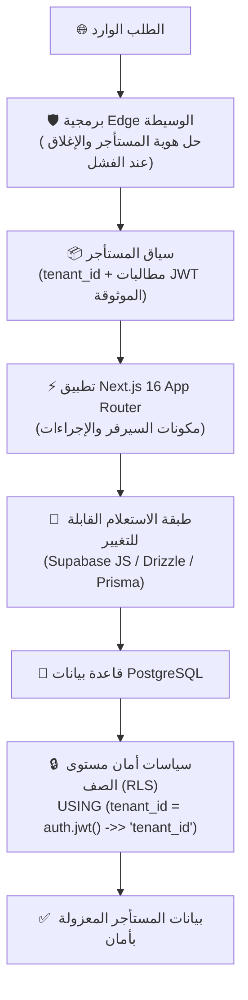
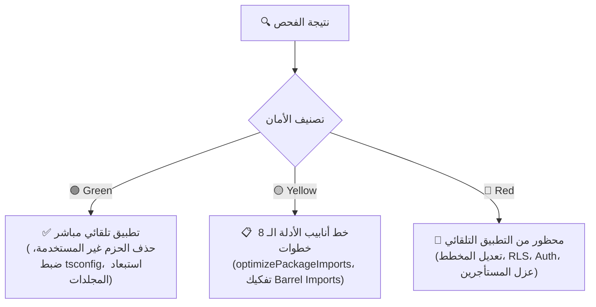

<div align="center" dir="rtl">

# ⚡ مهارة تايتفكتور لمعمارية ستارت أب `TidyFactor Next.js v1.1.0`
### محرك المعمارية السحابية متعددة المستأجرين (Multi-Tenant SaaS) وتأمين البيانات وتحسين أداء التطوير

**المسار المعماري المعتمد لبناء تطبيقات الساس متعددة المستأجرين وتحسين موارد بيئة التطوير على Next.js 16 و React 19 و TypeScript Strict و Supabase ضمن منظومة TidyFactor.**

[](https://www.npmjs.com/package/@alwkala/tidyfactor-next)
[](LICENSE)
[](#-نموذج-عزل-المستأجرين-الصارم-locked-tenant-isolation)
[](#-معمارية-المنظومة-والمكدس-التقني)
[-green.svg?style=for-the-badge)](#-منهجية-tidyfactor-وحوكمة-الامتثال-88-pass)

[✨ موقع الوكالة](https://alwkala.com) • [🔒 عزل المستأجرين](#-نموذج-عزل-المستأجرين-الصارم-locked-tenant-isolation) • [⚡ دورة حياة الأوامر الـ 14](#-دورة-حياة-أوامر-الساس-الـ-14-saas-command-lifecycle) • [🚀 محرك أداء التطوير](#-محرك-أداء-بيئة-التطوير-وتشخيص-عنق-الزجاجة-dev-perf-engine) • [🛡️ سياسات RLS والـ Auth](#%EF%B8%8F-مصفوفة-سياسات-rls-وخطافات-المصادقة) • [📖 English Version](README.md)

</div>

---

> [!IMPORTANT]
> **TidyFactor Next.js** هي مهارة ذكاء اصطناعي (AI Agent Skill) ومعمارية برمجية صارمة للوكلاء الأذكياء (*Google Antigravity, Claude Code, Cursor, Codex, Windsurf*) وكبار مهندسي الفول ستاك. تفرض المهارة **عزلاً غير قابل للاختراق لبيانات المستأجرين** باستخدام سياسات أمان مستوى الصف في بوستجريس (PostgreSQL RLS) كحاجز أمان صلب في قاعدة البيانات—مما يمنع تسريب البيانات وتلوث الحسابات متعددة المستأجرين تماماً من اليوم الأول.
>
> بالإضافة إلى ذلك، تدمج المهارة **محرك أداء بيئة التطوير القائم على الأدلة (Development Performance Engine)** لتشخيص اختناقات وموارد بيئة التطوير (ضغط الذاكرة RAM، ضغط القرص Disk I/O، شجرة الاعتماديات، نطاق TypeScript، ومراقبة الملفات) وتطبيق التحسينات الآمنة مع قياس الفروقات (DELTA Benchmarking).

---

## 🌟 القيمة المعمارية المضافة



| لمهندسي البرمجيات والفول ستاك | لمؤسسي منصات الـ SaaS والـ CTOs | لوكلاء الذكاء الاصطناعي (AI Agents) |
|---|---|---|
| **عزل مستأجرين صارم ومغلق**: مخطط بيانات مشترك (Shared Schema) مع `tenant_id` + سياسات Postgres RLS؛ وداعاً لتعقيدات المخطط لكل عميل وتجميع الاتصالات. | **ضمان عدم تسريب البيانات**: حاجز الأمان صلب على مستوى قاعدة البيانات، وأي خطأ برمجي في التطبيق لا يمكنه كشف بيانات عميل لآخر. | **توجيه موفر لسياق الذاكرة**: ملف `SKILL.md` خفيف جداً (~350 Tokens) يمنع حشو الذاكرة ويستدعي الملفات المحددة فقط عند الطلب. |
| **طبقة استعلام قابلة للتبديل**: اختيار Supabase JS client أو Drizzle ORM أو Prisma لمرة واحدة في `init`، والتزام كافة الأوامر باختيارك. | **خطاف مصادقة مخصص (Custom JWT Hook)**: حقن `tenant_id` و `role` من السيرفر مباشرة عند توليد التوكن دون الوثوق بمدخلات العميل. | **مسارات عمل محددة وقابلة للتحقق**: كل أمر ينتهي بقائمة فحص تحقق صارمة للتأكد من السلامة قبل التصدير. |
| **حل هوية آمن ومغلق (Fail-Closed)**: Middleware على الـ Edge يحل النطاق الفرعي أو المخصص مع الإغلاق المباشر (404/403) عند أي خطأ. | **معمارية خالية من القيود الاحتكارية**: مبنية على معايير Next.js App Router و PostgreSQL الرسمية بنسبة 100%. | **امتثال كامل بنسبة 100%**: مطابقة تامة مع معايير حوكمة مهارات الذكاء الاصطناعي في TidyFactor. |
| **محرك تحسين أداء التطوير**: تشخيص اختناقات الرام والمعالج والقرص قبل لمس الكود، مع توثيق قياسات قبل وبعد التحسين. | **تكلفة استضافة وبنية متوقعة**: اكتشاف تسريب حزم السيرفر لكود المتصفح والحد من تضخم حزم العميل (Client Bundles). | **حاجز أمان الساس الصارم**: منع أي تعديل أداء قد يُضعف سياسات RLS أو يمس عزل المستأجرين تلقائياً. |

---

## 🔒 نموذج عزل المستأجرين الصارم (Locked Tenant Isolation)

تفرض المهارة قواعد أمان صارمة وغير قابلة للتفاوض عبر دورة حياة التطبيق:

```sql
-- سياسة العزل القياسية للمستأجرين (النمط 1)
ALTER TABLE public.organizations ENABLE ROW LEVEL SECURITY;

CREATE POLICY "organizations_tenant_isolation_select" ON public.organizations
  FOR SELECT USING (tenant_id = (auth.jwt() ->> 'tenant_id')::uuid);

CREATE POLICY "organizations_tenant_isolation_insert" ON public.organizations
  FOR INSERT WITH CHECK (tenant_id = (auth.jwt() ->> 'tenant_id')::uuid);

CREATE POLICY "organizations_tenant_isolation_update" ON public.organizations
  FOR UPDATE USING (tenant_id = (auth.jwt() ->> 'tenant_id')::uuid)
  WITH CHECK (tenant_id = (auth.jwt() ->> 'tenant_id')::uuid);

CREATE POLICY "organizations_tenant_isolation_delete" ON public.organizations
  FOR DELETE USING (tenant_id = (auth.jwt() ->> 'tenant_id')::uuid);
```

### 🚨 القواعد الأمنية الحاكمة:
1. **سياسات RLS هي حاجز الأمان الحقيقي**: شرط `WHERE tenant_id = ...` في التطبيق هو مجرد تحسين لخطة الاستعلام، وغياب سياسة RLS يعتبر عيباً برمجياً خطيراً يمنع نشر الكود.
2. **عزل مفتاح `service_role`**: منع وصول مفتاح الصلاحيات المطلقة إلى كود العميل أو الـ APIs العامة نهائياً، واستخدامه حصراً في السيرفر مع إعادة التحقق من المستأجر.
3. **حل هوية المستأجر عند الـ Edge**: حل المستأجر مرة واحدة وتمرير السياق صراحة، ومنع إعادة اشتقاق الهوية عشوائياً داخل طبقات المكونات.
4. **تدقيق العمليات العابرة للمستأجرين**: عمليات الدخول الإداري بالنيابة (Impersonation) والتقارير العامة يجب عزلها واعتبارها نقاط تدقيق أمني حساسة.

---

## ⚡ دورة حياة أوامر الساس الـ 14 (SaaS Command Lifecycle)

تغطي المهارة كافة مراحل بناء منصات الساس عبر 14 أمراً تخصصياً:

| المرحلة | الأمر | نية واستخدام الأمر | ما يتم تحميله في الذاكرة | الحالة |
|---|---|---|---|:---:|
| **1. التأسيس** | `init` | توليد مشروع ساس جديد وتوثيق المعمارية في `ARCHITECTURE.md` | `references/workflows/init.md` + `spec.md` + `architecture-doc-skeleton.md` | ✅ **مكتمل** |
| **1. التأسيس** | `tenant` | حل هوية المستأجرين وسياق الـ Edge ودورة حياتهم | `references/workflows/tenant.md` + `references/memory/spec.md` | ✅ **مكتمل** |
| **2. الأمان** | `rls` | كتابة سياسات RLS بنمط السياسات الأربعة وتدقيق التسريب | `references/workflows/rls.md` + `spec.md` + `rls-patterns.md` | ✅ **مكتمل** |
| **2. الأمان** | `auth` | ضبط المصادقة وخطاف JWT والصلاحيات (RBAC/ABAC) | `references/workflows/auth.md` + `spec.md` + `auth-patterns.md` | ✅ **مكتمل** |
| **3. البيانات** | `data` | المخططات والـ Migrations والمعاملات والقيود | `references/commands/data.md` *(قيد التخطيط)* | ⏳ *قيد التطوير* |
| **3. البيانات** | `storage` | حاويات الملفات والروابط الموقعة المعزولة للمستأجر | `references/commands/storage.md` *(قيد التخطيط)* | ⏳ *قيد التطوير* |
| **4. التطبيق** | `api` | مسارات الـ Route Handlers والـ Server Actions والعقود | `references/commands/api.md` *(قيد التخطيط)* | ⏳ *قيد التطوير* |
| **4. التطبيق** | `app` | معمارية App Router و React 19 والـ RSC والـ Suspense | `references/commands/app.md` *(قيد التخطيط)* | ⏳ *قيد التطوير* |
| **5. الجودة** | `test` | اختبارات الوحدة وسياسات RLS والأمان والتكامل | `references/commands/test.md` *(قيد التخطيط)* | ⏳ *قيد التطوير* |
| **5. الجودة** | `observe` | تتبع السجلات والتدقيق المعزول وفحص الصحة | `references/commands/observe.md` *(قيد التخطيط)* | ⏳ *قيد التطوير* |
| **6. التشغيل** | `deploy` | النشر والبيئات والنسخ الاحتياطي اللحظي والـ Rollback | `references/commands/deploy.md` *(قيد التخطيط)* | ⏳ *قيد التطوير* |
| **6. التشغيل والأداء** | `perf` | تدقيق وتحسين أداء التطوير وتشخيص عنق الزجاجة وتطبيق التحسينات الآمنة والقياس | `references/commands/perf.md` + 4 مسارات عمل + 5 ملفات مرجعية | ✅ **مكتمل** |
| **7. الطوارئ** | `incident` | خطط التعافي من الكوارث ومعالجة التسريب البرمجي | `references/commands/incident.md` *(قيد التخطيط)* | ⏳ *قيد التطوير* |
| **7. الطوارئ** | `audit` | التدقيق المعماري الشامل والامتثال لمنصات الساس | `references/commands/audit.md` *(قيد التخطيط)* | ⏳ *قيد التطوير* |

---

## 🚀 محرك أداء بيئة التطوير وتشخيص عنق الزجاجة (Dev-Perf Engine)

على عكس نصائح الأداء التقليدية التي تركز فقط على أوقات تحميل المتصفح (Web Vitals)، يركز مسار `perf` على **تكلفة بيئة التطوير نفسها**: بطء إقلاع السيرفر، بطء التحديث اللحظي (HMR)، استهلاك الرام المفرط، واختناقات قراءة وكتابة القرص الصلب.

```
                 بيئة التطوير (Development Environment)
                                │
        ┌───────────────────────┼───────────────────────┐
        ↓                       ↓                       ↓
  الذاكرة (RAM)          المعالج (CPU)           القرص (Storage I/O)
        │                       │                       │
        └───────────────────────┼───────────────────────┘
                                ↓
                 أدوات التطوير (Toolchain)
                                │
        ┌───────────────────────┼───────────────────────┐
        ↓                       ↓                       ↓
   الاعتماديات             TypeScript                  المُحزّم
        ↓                       ↓                       ↓
  الاستيرادات                 ESLint               الكاش والتخزين
        └───────────────────────┼───────────────────────┘
                                ↓
                  تجربة المطور (Developer Experience)
```

### 1. الكشف عن النوايا والتوجيه (Phase 0)
لا يلمس المحرك أي ملف قبل التأكد من النية البرمجية:
- `AUDIT` → فحص شامل عبر 13 مرحلة وإصدار تقرير بـ 120 نقطة.
- `DIAGNOSE` → عزل عنق الزجاجة الأساسي عبر 6 نماذج سببية.
- `OPTIMIZE` → تطبيق التحسينات الآمنة (فئة 🟢 Green) فقط وتوثيق DELTA.
- `BENCHMARK` → القياس البارد والدافئ وحساب الوسيط الإحصائي.
- `REPORT` → عرض حالة التقرير والتحقق من صلاحيته وتغيرات الـ Git.

### 2. النماذج السببية الستة لتشخيص عنق الزجاجة (Causality Models)
- **النموذج A (ضغط الرام ← اختناق القرص)**: امتلاء الرام يجبر نظام التشغيل على استخدام ملف الترحيل (Pagefile/Swap)، مما يشل سرعة HMR والـ IDE.
- **النموذج B (شجرة الاعتماديات الضخمة ← ضغط المعالج والرام)**: حجم `node_modules` الكبير يعيق إقلاع السيرفر الأولي وفحص TypeScript.
- **النموذج C (بطء التخزين ← اختناق الكاش)**: عمليات القراءة والكتابة المكثفة لمجلد `.next/cache` على أقراص HDD/SATA البطيئة.
- **النموذج D (اتساع نطاق TypeScript)**: إدراج مجلدات المخرجات أو الملفات المولدة في `tsconfig.json` يثقل كاهل الـ Language Server.
- **النموذج E (تكلفة ESLint والأدوات)**: تشغيل قواعد `typeChecked` الثقيلة دون تفعيل الـ Cache.
- **النموذج F (تجاوز حدود مراقبة الملفات Watch Boundaries)**: وجود آلاف الملفات المرفوعة أو الفيديوهات داخل شجرة كود المشروع.

### 3. تصنيف درجات خطورة التحسينات



- **🟢 فئة خضراء (Green - آمنة)**: حذف الحزم المؤكد عدم استخدامها، تصحيح تصنيف `dependencies` و `devDependencies`، حصر نطاق `tsconfig.json`، وضبط استثناءات `watchIgnore`.
- **🟡 فئة صفراء (Yellow - تتطلب موافقة ودليل)**: تفعيل `optimizePackageImports` (مشروط بوجود أدلة واضحة)، إعادة هيكلة استيرادات الـ Barrel، وتحويل المكونات.
- **🔴 فئة حمراء (Red - محظورة نهائياً)**: تعديل مخطط قاعدة البيانات، تغيير سياسات RLS، المساس بالمصادقة وعزل المستأجرين، أو إيقاف الكاش كلياً.

### 4. بروتوكول التحكم في ضوضاء القياس (Noise Control)
القياس لمرة واحدة غير دقيق بسبب كاش النظام والعمليات الخلفية:
- **الفصل بين القياس البارد والدافئ (Cold vs Warm)**: التمييز بين أسوأ سيناريو (Cold Start) وتجربة المطور اليومية (Warm Restart).
- **حساب الوسيط الإحصائي (Median of 3 Runs)**: تكرار كل اختبار 3 مرات واعتماد الوسيط الحسابي.
- **قاعدة عتبة الضوضاء (Noise Threshold)**: إذا تجاوز الفرق بين أعلى وأقل قياس 20%، يعتبر القياس غير صالح ويُعاد اختباره.

---

## 🛡️ مصفوفة سياسات RLS وخطافات المصادقة

### 1. جدول عضويات المستأجرين (`tenant_memberships`)
```sql
CREATE TABLE public.tenant_memberships (
  id uuid PRIMARY KEY DEFAULT gen_random_uuid(),
  tenant_id uuid NOT NULL REFERENCES public.tenants(id) ON DELETE CASCADE,
  user_id uuid NOT NULL REFERENCES auth.users(id) ON DELETE CASCADE,
  role text NOT NULL DEFAULT 'member',
  created_at timestamptz NOT NULL DEFAULT now(),
  UNIQUE (tenant_id, user_id)
);
ALTER TABLE public.tenant_memberships ENABLE ROW LEVEL SECURITY;

CREATE POLICY "memberships_self_select" ON public.tenant_memberships
  FOR SELECT USING (user_id = auth.uid());
```

### 2. خطاف مخصص لحقن مطالبات التوكن في Supabase (Custom Token Hook)
```sql
CREATE OR REPLACE FUNCTION public.custom_access_token_hook(event jsonb)
RETURNS jsonb LANGUAGE plpgsql STABLE AS $$
DECLARE
  claims jsonb;
  membership record;
BEGIN
  claims := event->'claims';
  SELECT tenant_id, role INTO membership
  FROM public.tenant_memberships
  WHERE user_id = (event->>'user_id')::uuid
  LIMIT 1;

  IF membership IS NOT NULL THEN
    claims := jsonb_set(claims, '{tenant_id}', to_jsonb(membership.tenant_id));
    claims := jsonb_set(claims, '{role}', to_jsonb(membership.role));
  END IF;
  RETURN event;
END;
$$;
```

---

## 📋 ذاكرة المشروع وسجل القرارات المعمارية (`ARCHITECTURE.md`)

تقوم المهارة أثناء أمر `init` بتوليد ملف `ARCHITECTURE.md` في جذر المشروع، ليعمل كـ **مصدر حقيقة موحد (Single Source of Truth)** يمنع انحراف القرارات عبر الجلسات:
- **المعمارية الأساسية الثابتة**: App Router و React 19 و TypeScript strict و Postgres RLS.
- **القرارات المختارة لمرة واحدة**: طبقة الاستعلام (Supabase JS, Drizzle, Prisma)، استراتيجية حل المستأجر، مزود المصادقة، ونموذج الصلاحيات.
- **سياق الأداء (Performance Context)**: الاختناقات المعروفة، استراتيجية التخزين، نقطة القياس النشطة، وتاريخ آخر تدقيق أداء.
- **سجل القرارات المعمارية (ADR Log)**: سجل غير قابل للحذف يوثق كل قرار معماري هام مع أسبابه وبدائله.
- **سجل المخاطر والديون التقنية (Open Risks)**: سجل مرتب حسب الأولوية (P0 إلى P3) يتم تغذيته تلقائياً من أوامر `perf` و `rls` و `audit`.

---

## 🚀 التثبيت والاستخدام

### 1. معالج التثبيت التفاعلي:

```bash
# تشغيل معالج التثبيت التفاعلي المباشر
npx @alwkala/tidyfactor-next
```

### 2. حقن المهارة داخل مشروع Next.js حالي:

```bash
# إضافة المهارة مباشرة لمجلد .agents/skills/ في مشروعك
npx @alwkala/tidyfactor-next add-skill
```

### 3. النسخ المباشر لمجلد مهارات الوكيل الذكي:

- **Google Antigravity:** `.agents/skills/tidyfactor-next/`
- **Claude Code:** `.claude-skill/skills/tidyfactor-next/`
- **Cursor / Codex / Windsurf:** `.agents/skills/tidyfactor-next/`

---

## 🏛️ منهجية TidyFactor وحوكمة الامتثال (8/8 Pass)

حققت مهارة `tidyfactor-next` نسبة امتثال **100% (8/8 علامات)** وفق معايير `tidyfactor-skill-architect`:

1. ✅ **انضباط التوجيه (Dispatcher Discipline)**: ملف `SKILL.md` يعمل كموجّه مسارات فقط بدون حشو.
2. ✅ **مسار واحد لكل نتيجة (One Workflow = One Outcome)**: مسارات عمل معتمدة تنتهي بقوائم تحقق واضحة.
3. ✅ **ذاكرة تشغيلية نقية (Operational Memory)**: قوالب SQL DDL وسياسات وقواعد تقنية خالصة بدون تنظير.
4. ✅ **انعدام الهياكل الفارغة (No Empty Structures)**: بنية مسطحة خالية من المجلدات الأحادية.
5. ✅ **عزل الفلسفة عن الكود (Philosophy Isolation)**: فصل المعايير التشغيلية عن الخطابات الترويجية.
6. ✅ **نمو مدفوع بالمحفزات (Trigger-Justified Growth)**: إضافة الأوامر بناءً على محفزات معمارية دقيقة.
7. ✅ **حاجز الأمان والجودة (Security Quality Bar)**: استعلامات تحقق تلقائية لتغطية RLS وتشخيص التسريب.
8. ✅ **تطابق البيئات المتعددة (Cross-Platform Parity)**: توافق كامل بين Antigravity و Claude و Cursor و Codex.

---

## 👨‍💻 معلومات المطور والجهة المطورة

- **الجهة المطورة:** [وكالة الوكالة الرقمية — Alwkala](https://alwkala.com)
- **المنظومة:** [منظومة TidyFactor للمعمارية والمهارات](https://tidyfactor.com)
- **المهندس المعماري الرئيسي:** وائل الصديق — Wael S. ([@waels](https://github.com/alwkala))
- **البريد الإلكتروني:** [hello@alwkala.com](mailto:hello@alwkala.com)
- **الدعم والاستفسارات:** [https://alwkala.com](https://alwkala.com)

---

## 📜 الترخيص وحوكمة المعايير

المهارة منشورة تحت **رخصة MIT**. جميع الحقوق محفوظة © 2026 [Alwkala](https://alwkala.com) / منظومة TidyFactor.


---

## 🏛️ معمارية منظومة TidyFactor

**منظومة TidyFactor** هي بيئة معمارية برمجية مفتوحة وحزم مهارات لوكلاء الذكاء الاصطناعي قائمة على الفصل التام للمسؤوليات عبر دورة حياة المنتجات:

```text
منظمة TidyFactor الرسمية (github.com/TidyFactor)
│
├── مهارات التصميم (Design Skills)
│   ├── Cinematic    ← تجربة الإبهار البصري / Experience ("Wow")     (صفحات سينمائية تفاعلية)
│   ├── Design       ← بناء النماذج الأولية / Prototype ("Build")   (محرك تصميم كودي وبديل Figma)
│   └── Styler       ← الجاهزية للإنتاج والتنسيق / Production ("Ship")  (محرك التنسيق ودعم RTL)
│
├── مهارات التطوير البرمجي (Development Skills)
│   ├── HTML         ← المواقع الثابتة وسيو المحتوى / Static & SEO   (هياكل خفيفة وسريعة)
│   ├── HTMX         ← الواجهات التفاعلية الخفيفة / Hypermedia        (تفاعلات بدون جافاسكريبت معقدة)
│   ├── JS           ← تطبيقات الصفحة الواحدة بدون أطر / Vanilla SPA  (نماذج تفاعلية بـ ES Modules)
│   ├── PHP          ← المنظومات المخدمية الحديثة / Server-Rendered  (مكونات حديثة وتطبيقات PHP 8)
│   └── Next         ← منصات الساس متعددة المستأجرين / Multi-Tenant (Next.js 16 + Postgres RLS)
│
└── مهارات النمو والتسويق (Growth Skills)
    └── Marketing    ← استراتيجيات النمو والمبيعات / Growth & SEO    (تسويق الاستجابة المباشرة)
```

### 💎 ثلاثي الواجهات الأمامية والتجربة (Frontend Triad)

```text
                TidyFactor
                    │
          ┌─────────┼─────────┐
          │         │         │
      Cinematic   Design    Styler
          │         │         │
       Experience Prototype Production
          │         │         │
       "Wow"      "Build"   "Ship"
```

### 📦 مصفوفة التكامل الشامل للمجتمع (GitHub • Skill • NPM)

| المسار البرمجي | الفئة | مستودع GitHub | مهارة الوكيل | حزمة NPM |
| :--- | :--- | :--- | :--- | :--- |
| **Cinematic** | التصميم | [`TidyFactor/Cinematic`](https://github.com/TidyFactor/Cinematic) | `tidyfactor-cinematic` | [`@alwkala/create-cinematic-kit`](https://www.npmjs.com/package/@alwkala/create-cinematic-kit) |
| **Design** | التصميم | [`TidyFactor/Design`](https://github.com/TidyFactor/Design) | `tidyfactor-design` | [`@alwkala/tidyfactor-design`](https://www.npmjs.com/package/@alwkala/tidyfactor-design) |
| **Styler** | التصميم | [`TidyFactor/Styler`](https://github.com/TidyFactor/Styler) | `tidyfactor-styler` | [`@alwkala/tidyfactor-styler`](https://www.npmjs.com/package/@alwkala/tidyfactor-styler) |
| **Next** | التطوير | [`TidyFactor/Next`](https://github.com/TidyFactor/Next) | `tidyfactor-next` | [`@alwkala/tidyfactor-next`](https://www.npmjs.com/package/@alwkala/tidyfactor-next) |
| **HTML** | التطوير | [`TidyFactor/HTML`](https://github.com/TidyFactor/HTML) | `tidyfactor-html` | [`@alwkala/tidyfactor-html`](https://www.npmjs.com/package/@alwkala/tidyfactor-html) |
| **HTMX** | التطوير | [`TidyFactor/HTMX`](https://github.com/TidyFactor/HTMX) | `tidyfactor-htmx` | [`@alwkala/tidyfactor-htmx`](https://www.npmjs.com/package/@alwkala/tidyfactor-htmx) |
| **JS** | التطوير | [`TidyFactor/JS`](https://github.com/TidyFactor/JS) | `tidyfactor-js` | [`@alwkala/tidyfactor-js`](https://www.npmjs.com/package/@alwkala/tidyfactor-js) |
| **PHP** | التطوير | [`TidyFactor/PHP`](https://github.com/TidyFactor/PHP) | `tidyfactor-php` | [`@alwkala/tidyfactor-php`](https://www.npmjs.com/package/@alwkala/tidyfactor-php) |
| **Marketing** | النمو | [`TidyFactor/Marketing`](https://github.com/TidyFactor/Marketing) | `tidyfactor-marketing` | [`@alwkala/tidyfactor-marketing`](https://www.npmjs.com/package/@alwkala/tidyfactor-marketing) |

---

## 👨‍💻 المنظمة والتواصل والدعم

- 🌐 **الموقع الرسمي للمنظومة:** [https://tidyfactor.com/](https://tidyfactor.com/)
- 📚 **التوثيق الرسمي المعتمد:** [https://tidyfactor.com/documentation](https://tidyfactor.com/documentation)
- 🤝 **الشريك التقني الرسمي:** [الوكالة الرقمية Alwkala](https://alwkala.com/)
- 🐙 **منظمة GitHub الرسمية:** [github.com/TidyFactor](https://github.com/TidyFactor)
- 📧 **استفسارات الأعمال والشركات:** [hello@tidyfactor.com](mailto:hello@tidyfactor.com)
- 📱 **واتساب:** [+20 101 665 6899](https://wa.me/201016656899)
- 📞 **الهاتف:** +20 101 665 6899
- 📍 **المقر:** القاهرة، جمهورية مصر العربية

---

## 📜 الترخيص والمجتمع

مرخصة تحت رخصة **Apache License 2.0**. حقوق النشر محفوظة (c) 2026 لصالح [منظومة TidyFactor](https://tidyfactor.com) و[الوكالة الرقمية Alwkala](https://alwkala.com).
