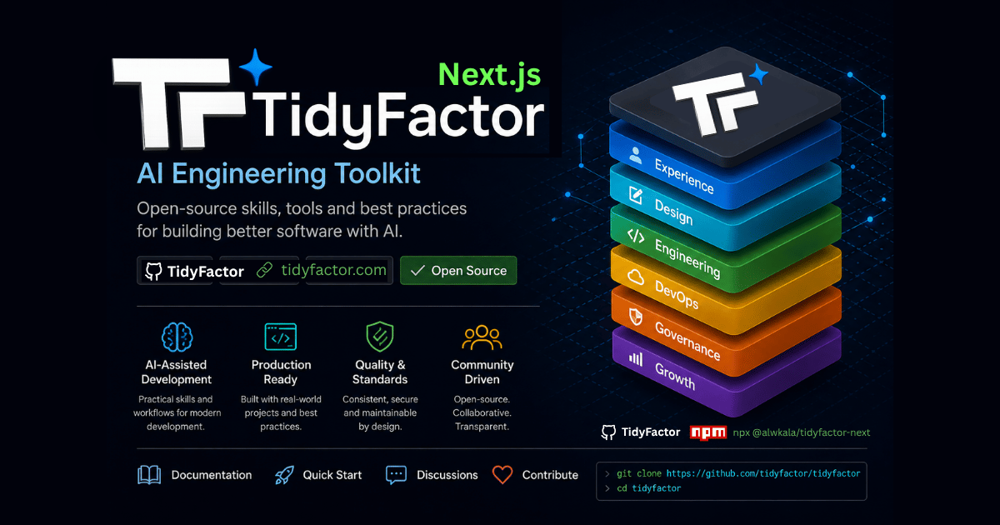
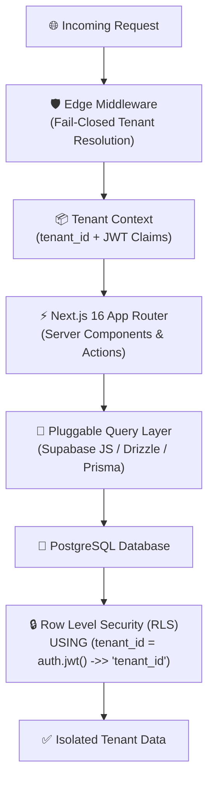
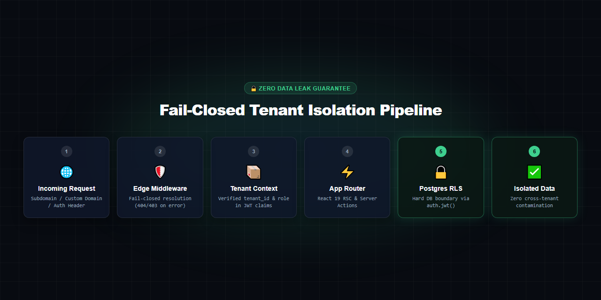
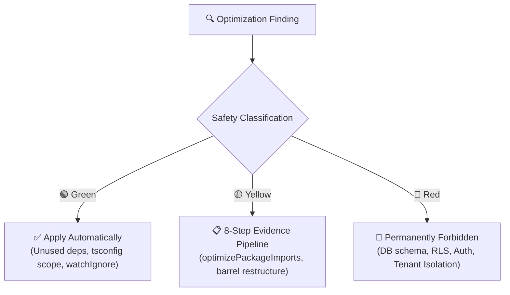

<div align="center">

# ⚡ TidyFactor Next.js `v1.4.0`
### The Production-Grade Multi-Tenant SaaS Architecture & Performance Skill for AI Coding Agents

Give **Google Antigravity, Claude Code, Cursor, OpenAI Codex, or Windsurf** a locked, security-first architecture for **Next.js 16 + React 19 + Supabase** — so your agent stops improvising tenant isolation and starts enforcing it.

[](https://www.npmjs.com/package/@alwkala/tidyfactor-next)
[](LICENSE)
[](#-locked-tenant-isolation-model)
[](#-why-tidyfactornext)
[-green.svg?style=for-the-badge)](#%EF%B8%8F-tidyfactor-skill-methodology--governance)

[🚀 Quick Start](#-quick-start) • [🎯 Why TidyFactor/Next](#-why-tidyfactornext) • [🔒 Tenant Isolation](#-locked-tenant-isolation-model) • [⚡ 15-Stage Lifecycle](#-15-stage-saas-command-lifecycle) • [🚀 Perf Engine](#-performance--optimization-engine) • [❓ FAQ](#-faq) • [📖 بالعربية](README.ar.md)

<br/><br/>

<p align="center">
  
</p>

</div>

---

## 📚 Table of Contents

- [🎯 Why TidyFactor/Next](#-why-tidyfactornext)
- [🚀 Quick Start](#-quick-start)
- [🌟 Architectural Value Proposition](#-architectural-value-proposition)
- [🔒 Locked Tenant Isolation Model](#-locked-tenant-isolation-model)
- [⚡ 15-Stage SaaS Command Lifecycle](#-15-stage-saas-command-lifecycle)
- [🚀 Performance & Optimization Engine](#-performance--optimization-engine)
  - [1. 8-Tier Runtime Performance Rules (Vercel Engineering)](#1-8-tier-runtime-performance-rules-vercel-engineering)
  - [2. Development Environment Resource Diagnostics](#2-development-environment-resource-diagnostics)
  - [3. Optimization Safety Tiers (Green / Yellow / Red)](#3-optimization-safety-tiers-green--yellow--red)
- [🛡️ RLS Policy Matrix & Auth Hooks](#%EF%B8%8F-rls-policy-matrix--auth-hooks)
- [📋 Project Memory & ARCHITECTURE.md](#-project-memory--architecturemd)
- [❓ FAQ](#-faq)
- [🏛️ The TidyFactor Ecosystem](#%EF%B8%8F-the-tidyfactor-ecosystem)
- [🏛️ TidyFactor Skill Methodology & Governance](#%EF%B8%8F-tidyfactor-skill-methodology--governance)
- [🤝 Contributing](#-contributing)
- [👨‍💻 Support](#-support)
- [📜 License](#-license)

---

## 🎯 Why TidyFactor/Next

Most Next.js agent skills teach your AI how to write idiomatic code — App Router conventions, caching APIs, and bundle-size tweaks. That is necessary, but it does **not** stop an agent from shipping a query that accidentally leaks Tenant A's data into Tenant B's dashboard.

**TidyFactor/Next sits one layer deeper: it is an architecture and hard security contract, not just a style guide.**

| Dimension | Generic Next.js Skills | `tidyfactor-next` |
|---|---|---|
| **What it teaches** | Idiomatic App Router, React 19 RSC boundaries, caching | Multi-tenant architecture + non-negotiable Postgres RLS boundary |
| **Scope** | **Breadth**: Many small, composable coding snippets | **Depth**: One vertical (multi-tenant SaaS), owned end-to-end |
| **Failure mode prevented** | Slow client components, suboptimal bundles | Cross-tenant data leaks, forgotten `WHERE tenant_id = ...` clauses |
| **Performance scope** | Basic production advice | **Dual engine**: 8 runtime optimization tiers + 6 dev-environment bottleneck models |
| **Governance score** | Unverified | **100% Architect Score** (passes all TidyFactor Skill Architect rules) |
| **Use together?** | ✅ | ✅ — Install both; they complement each other perfectly |

> [!TIP]
> If you are building a SaaS where a cross-tenant data leak means a lawsuit, **`tidyfactor-next` is the foundational guardrail layer your AI agent needs** in addition to general React best practices.

---

## 🚀 Quick Start

### 1. Interactive Project Wizard & Direct Injection

```bash
# Interactive project wizard — scaffolds a new multi-tenant SaaS project
npx @alwkala/tidyfactor-next

# Or inject the skill directly into an existing Next.js repository
npx @alwkala/tidyfactor-next add-skill
```

### 2. Workspace Installation per AI Agent

| AI Agent | Workspace Skill Path |
|---|---|
| **Google Antigravity** | `.agents/skills/tidyfactor-next/` or global `~/.gemini/config/skills/` |
| **Claude Code** | `.claude-skill/skills/tidyfactor-next/` |
| **Cursor / Codex / Windsurf** | `.agents/skills/tidyfactor-next/` |

Once installed, invoke `/init` or `/brief` inside your AI agent to discover project baselines and scaffold your `ARCHITECTURE.md` single source of truth!

---

## 🌟 Architectural Value Proposition



<p align="center">
  
</p>

| For Fullstack Engineers | For SaaS Founders & CTOs | For AI Coding Agents |
|---|---|---|
| **Locked Tenant Isolation**: Shared schema with `tenant_id` + Postgres RLS. No schema-per-tenant migration hell or multi-DB connection pooling chaos. | **Zero Data-Leak Guarantee**: Hard security boundary at the database layer; application bugs cannot expose Tenant A's records to Tenant B. | **Context-Efficient Dispatcher**: Lightweight `SKILL.md` router loads only ~350 tokens at start, pulling memory only on demand. |
| **Pluggable Query Layer**: Choose Supabase JS, Drizzle ORM, or Prisma once during `init`. All downstream code adheres strictly to your choice. | **Custom JWT Access Token Hook**: Injects verified `tenant_id` and `role` server-side at token issuance—never trusted from client input. | **Deterministic Workflows**: Every command runs against a strict, quantifiable validation checklist before shipping. |
| **Fail-Closed Resolution**: Edge middleware resolves tenant via subdomain, custom domain, or session claim, failing closed (404/403) on error. | **Zero Lock-in Architecture**: Pure Next.js App Router and PostgreSQL standards with zero black-box vendor runtime dependencies. | **100% Governance Compliance**: Fully compliant (8/8) with the official TidyFactor Skill Architect governance specification. |
| **Evidence-Based Perf Engine**: Diagnoses RAM, CPU, and Disk bottlenecks before touching code; benchmark-backed DELTA verification. | **Predictable Infrastructure Cost**: Identifies bloated client bundles and server secret leaks before deployment. | **SaaS Safety Boundary**: Automatically prohibits performance optimizations that weaken RLS or tenant isolation. |

---

## 🔒 Locked Tenant Isolation Model

`tidyfactor-next` enforces strict, non-negotiable isolation rules across the entire lifecycle:

```sql
-- Standard Tenant Isolation Policy (Pattern 1)
ALTER TABLE public.organizations ENABLE ROW LEVEL SECURITY;

CREATE POLICY "organizations_tenant_isolation_select" ON public.organizations
  FOR SELECT USING (tenant_id = (auth.jwt() ->> 'tenant_id')::uuid);

CREATE POLICY "organizations_tenant_isolation_insert" ON public.organizations
  FOR INSERT WITH CHECK (tenant_id = (auth.jwt() ->> 'tenant_id')::uuid);

CREATE POLICY "organizations_tenant_isolation_update" ON public.organizations
  FOR UPDATE USING (tenant_id = (auth.jwt() ->> 'tenant_id')::uuid)
  WITH CHECK (tenant_id = (auth.jwt() ->> 'tenant_id')::uuid);

CREATE POLICY "organizations_tenant_isolation_delete" ON public.organizations
  FOR DELETE USING (tenant_id = (auth.jwt() ->> 'tenant_id')::uuid);
```

### 🚨 Non-Negotiable Safety Directives:
1. **RLS is the Security Boundary**: Application-layer `WHERE tenant_id = ...` is only a query-plan hint. If RLS is disabled, the system is defective by definition.
2. **`service_role` Key Isolation**: Never exposed to client bundles or public endpoints. Used exclusively in server-only contexts with re-verified tenant context.
3. **Edge Context Propagation**: Tenant identity is resolved once at the edge and passed down—never re-derived haphazardly in deep component trees.
4. **Cross-Tenant Operations Review**: Admin impersonation, cross-tenant migrations, or platform analytics must be isolated and flagged as security review triggers.

---

## ⚡ 15-Stage SaaS Command Lifecycle

The entire SaaS engineering lifecycle is structured into 15 deterministic commands with **100% operational coverage**:

| Stage | Command | User Intent | What It Loads | Status |
|---|---|---|---|:---:|
| **0. Discovery** | `brief` | Pre-flight CDL discovery & baseline architecture cache | `references/workflows/brief.md` + `decision-points.md` + `quality-bar.md` | ✅ **Built** |
| **1. Foundation** | `init` | Scaffold new multi-tenant project & generate `ARCHITECTURE.md` | `references/workflows/init.md` + `spec.md` + `architecture-doc-skeleton.md` | ✅ **Built** |
| **1. Foundation** | `tenant` | Tenant resolution, context propagation, lifecycle | `references/workflows/tenant.md` + `references/memory/spec.md` | ✅ **Built** |
| **2. Security** | `rls` | RLS policy authoring, 4-policy pattern, leak audit | `references/workflows/rls.md` + `spec.md` + `rls-patterns.md` | ✅ **Built** |
| **2. Security** | `auth` | Supabase Auth, custom JWT claims hook, RBAC/ABAC | `references/workflows/auth.md` + `spec.md` + `auth-patterns.md` | ✅ **Built** |
| **3. Data** | `data` | Schema, migrations, transactions, constraints | `references/workflows/data.md` + `references/memory/decision-points.md` | ✅ **Built** |
| **3. Data** | `storage` | Tenant-scoped buckets, signed URLs, storage RLS | `references/workflows/storage.md` + `references/memory/cache-storage-rules.md` | ✅ **Built** |
| **4. Application** | `api` | Route handlers, server actions, API contracts | `references/workflows/api.md` + `client-server-boundaries.md` + `react-perf-rules.md` | ✅ **Built** |
| **4. Application** | `app` | App Router, React 19, RSC boundaries, Suspense | `references/workflows/app.md` + `client-server-boundaries.md` + `react-perf-rules.md` | ✅ **Built** |
| **5. Quality** | `test` | Unit, integration, RLS coverage, E2E security tests | `references/workflows/test.md` + `references/memory/quality-bar.md` | ✅ **Built** |
| **5. Quality** | `observe` | Tracing, tenant-scoped audit logs, health checks | `references/workflows/observe.md` + `references/memory/quality-bar.md` | ✅ **Built** |
| **6. DevOps** | `deploy` | CI/CD, environments, rollback, point-in-time backups | `references/workflows/deploy.md` + `references/memory/spec.md` | ✅ **Built** |
| **6. DevOps / Perf** | `perf` | Dev & runtime performance audit, bottleneck diagnosis, safe perf | `references/workflows/audit-dev-perf.md` + `perf-optimization-rules.md` + `react-perf-rules.md` | ✅ **Built** |
| **7. Operations** | `incident` | Disaster recovery, tenant leak remediation runbooks | `references/workflows/incident.md` + `references/memory/spec.md` | ✅ **Built** |
| **7. Operations** | `audit` | Full-stack multi-tenant architecture compliance audit | `references/workflows/audit.md` + `references/memory/quality-bar.md` | ✅ **Built** |

---

## 🚀 Performance & Optimization Engine

### 1. 8-Tier Runtime Performance Rules (Vercel Engineering)

`tidyfactor-next` encapsulates 40+ runtime optimization rules categorized into 8 impact-ranked tiers (`references/memory/react-perf-rules.md`):

1. **Tier 1: Eliminating Waterfalls (`async-*`) [CRITICAL]**: Check synchronous conditions before `await`, defer `await` to consuming branches, parallelize independent queries with `Promise.all()`, stream async subtrees with `<Suspense>`.
2. **Tier 2: Bundle Size Optimization (`bundle-*`) [CRITICAL]**: Avoid barrel files, configure `optimizePackageImports`, lazy-load heavy widgets with `next/dynamic({ ssr: false })`, defer 3rd-party scripts.
3. **Tier 3: Server-Side Performance (`server-*`) [HIGH]**: Wrap per-request data fetchers with `React.cache()`, offload non-blocking telemetry and audit logs to Next.js 16 `after()`, pass only minimal serialized DTOs across the RSC $\to$ RCC boundary.
4. **Tier 4: Client-Side Data Fetching (`client-*`) [MEDIUM-HIGH]**: SWR / TanStack Query automatic deduplication, passive scroll listeners.
5. **Tier 5: Re-render Optimization (`rerender-*`) [MEDIUM]**: Pure derived state in render (never synchronize via `useEffect`), avoid `useMemo` on cheap primitives, lazy `useState` initializers, `startTransition` / `useDeferredValue`.
6. **Tier 6: Rendering Performance (`rendering-*`) [MEDIUM]**: CSS `content-visibility: auto`, hoist static JSX elements outside render, use explicit conditionals.
7. **Tier 7: JavaScript Performance (`js-*`) [LOW-MEDIUM]**: Layout thrashing prevention (batch DOM read/write), `Set`/`Map` $O(1)$ lookups, `toSorted()` immutability.
8. **Tier 8: Advanced React Patterns (`advanced-*`) [LOW]**: Extract non-reactive callback logic with `useEffectEvent`, single-mount app initialization.

### 2. Development Environment Resource Diagnostics

Tackles dev-server startup slowness, sluggish HMR, RAM bloat, and disk I/O through **6 Causality Models**:
- **Model A (RAM Pressure → Disk I/O)**: Memory saturation causing OS paging to swap.
- **Model B (Large Dependency Graph → CPU/RAM)**: Massive module trees slowing cold starts.
- **Model C (Slow Storage → Cache I/O)**: `.next/cache` I/O bottlenecks.
- **Model D (TypeScript Scope Overreach)**: Wide `include` scopes analyzing generated or test files.
- **Model E (ESLint / Tooling Overhead)**: `typeChecked` rules running without caching.
- **Model F (Watch Boundary Overflow)**: Thousands of media uploads monitored by file watchers.

### 3. Optimization Safety Tiers (Green / Yellow / Red)



- **🟢 Green (Safe)**: Unused dependency cleanup, `dependencies` vs `devDependencies` correction, `tsconfig.json` scope tightening, `.gitignore` & `watchIgnore` fixes.
- **🟡 Yellow (Review Required)**: Evidence-based `optimizePackageImports`, barrel import restructuring, client-to-server component conversion.
- **🔴 Red (Permanently Forbidden)**: Modifying database schema, RLS policies, auth flows, tenant isolation models, or globally disabling caching.

---

## 🛡️ RLS Policy Matrix & Auth Hooks

### 1. `tenant_memberships` Join Model
```sql
CREATE TABLE public.tenant_memberships (
  id uuid PRIMARY KEY DEFAULT gen_random_uuid(),
  tenant_id uuid NOT NULL REFERENCES public.tenants(id) ON DELETE CASCADE,
  user_id uuid NOT NULL REFERENCES auth.users(id) ON DELETE CASCADE,
  role text NOT NULL DEFAULT 'member',
  created_at timestamptz NOT NULL DEFAULT now(),
  UNIQUE (tenant_id, user_id)
);
ALTER TABLE public.tenant_memberships ENABLE ROW LEVEL SECURITY;

CREATE POLICY "memberships_self_select" ON public.tenant_memberships
  FOR SELECT USING (user_id = auth.uid());
```

### 2. Supabase Custom Access Token Hook
```sql
CREATE OR REPLACE FUNCTION public.custom_access_token_hook(event jsonb)
RETURNS jsonb LANGUAGE plpgsql STABLE AS $$
DECLARE
  claims jsonb;
  membership record;
BEGIN
  claims := event->'claims';
  SELECT tenant_id, role INTO membership
  FROM public.tenant_memberships
  WHERE user_id = (event->>'user_id')::uuid
  LIMIT 1;

  IF membership IS NOT NULL THEN
    claims := jsonb_set(claims, '{tenant_id}', to_jsonb(membership.tenant_id));
    claims := jsonb_set(claims, '{role}', to_jsonb(membership.role));
  END IF;
  RETURN event;
END;
$$;
```

---

## 📋 Project Memory & `ARCHITECTURE.md`

During `/init`, the skill generates an `ARCHITECTURE.md` file in your project root. This document serves as the **Single Source of Truth** for architectural decisions across AI agent sessions:
- **Locked Platform Choices**: App Router, React 19, TypeScript strict, Postgres RLS.
- **Chosen Once Decisions**: Query layer (Supabase JS, Drizzle, Prisma), tenant resolution strategy, auth provider, role model.
- **Performance Context**: Known bottlenecks, storage strategy, active baseline, last audit timestamp & git commit SHA.
- **ADR Log**: Append-only register recording significant architectural decisions.
- **Open Risks & Tech Debt**: Prioritized register (P0–P3) tracked across `perf`, `rls`, `audit`, and `incident` commands.

---

## ❓ FAQ

<details>
<summary><b>Does this replace generic Next.js skills like <code>react-best-practices</code>?</b></summary>
<br/>
<b>No — use both.</b> <code>tidyfactor-next</code> governs multi-tenant architecture, data isolation, and Postgres RLS security contracts. General best-practice skills focus on general React idioms and client-side styling. They do not overlap; <code>tidyfactor-next</code> incorporates runtime optimization rules directly.
</details>

<details>
<summary><b>Which AI coding agents are supported?</b></summary>
<br/>
<b>Google Antigravity, Claude Code, Cursor, OpenAI Codex, and Windsurf</b> are all supported with 100% behavioral parity.
</details>

<details>
<summary><b>Can I use Drizzle ORM or Prisma instead of the Supabase JS client?</b></summary>
<br/>
<b>Yes.</b> The query layer is a "chosen-once" decision made during <code>init</code> or <code>brief</code>. All generated schema models, queries, and repositories follow your confirmed choice.
</details>

<details>
<summary><b>What happens if RLS is accidentally disabled on a table?</b></summary>
<br/>
By this skill's definition, the system is defective. The <code>/rls</code> and <code>/audit</code> commands include automated leak-audit queries against <code>pg_tables</code> and <code>pg_policies</code> to flag unshielded tables immediately.
</details>

<details>
<summary><b>How does the Contextual Decision Layer (CDL) work?</b></summary>
<br/>
The CDL runs a single-round pre-flight interview via <code>/brief</code> and caches baseline stack choices in <code>.tidyfactor/next-brief.md</code>, allowing downstream commands to execute silently without repeating questions.
</details>

---

## 🏛️ The TidyFactor Ecosystem

**TidyFactor** is a modular web architecture and AI coding agent skill ecosystem built on clear separation of concerns across the product lifecycle:

```
TidyFactor Organization (github.com/TidyFactor)
│
├── Design Skills
│   ├── Cinematic    → Experience / "Wow"     (Apple × Cartier Scroll-Driven Landing Pages)
│   ├── Design       → Prototype / "Build"    (Code-Native UI Design Engine & Figma Alternative)
│   └── Styler       → Production / "Ship"    (Framework Styler & RTL Polish Engine)
│
├── Development Skills
│   ├── HTML         → Content & Static       (Semantic SEO & Static Platform Starter)
│   ├── HTMX         → Hypermedia             (Server-Driven Micro-Interactions)
│   ├── JS           → Vanilla SPA            (Framework-Free Reactive ES Modules)
│   ├── PHP          → Server-Rendered        (Modern PHP 8.x Component UI & Architecture)
│   └── Next         → Multi-Tenant SaaS      (Next.js 16, React 19, Supabase RLS & Dev-Perf)
│
└── Growth Skills
    └── Marketing    → Growth / Revenue       (Direct Response, Pillar SEO & Content Lifecycles)
```

### 📦 Community Package & Skill Parity

| Track | Category | GitHub Repository | Agent Skill | NPM Package |
| :--- | :--- | :--- | :--- | :--- |
| **Next** | Development | [`TidyFactor/Next`](https://github.com/TidyFactor/Next) | `tidyfactor-next` | [`@alwkala/tidyfactor-next`](https://www.npmjs.com/package/@alwkala/tidyfactor-next) |
| **Cinematic** | Design | [`TidyFactor/Cinematic`](https://github.com/TidyFactor/Cinematic) | `tidyfactor-cinematic` | [`@alwkala/create-cinematic-kit`](https://www.npmjs.com/package/@alwkala/create-cinematic-kit) |
| **Design** | Design | [`TidyFactor/Design`](https://github.com/TidyFactor/Design) | `tidyfactor-design` | [`@alwkala/tidyfactor-design`](https://www.npmjs.com/package/@alwkala/tidyfactor-design) |
| **Styler** | Design | [`TidyFactor/Styler`](https://github.com/TidyFactor/Styler) | `tidyfactor-styler` | [`@alwkala/tidyfactor-styler`](https://www.npmjs.com/package/@alwkala/tidyfactor-styler) |
| **HTML** | Development | [`TidyFactor/HTML`](https://github.com/TidyFactor/HTML) | `tidyfactor-html` | [`@alwkala/tidyfactor-html`](https://www.npmjs.com/package/@alwkala/tidyfactor-html) |
| **HTMX** | Development | [`TidyFactor/HTMX`](https://github.com/TidyFactor/HTMX) | `tidyfactor-htmx` | [`@alwkala/tidyfactor-htmx`](https://www.npmjs.com/package/@alwkala/tidyfactor-htmx) |
| **JS** | Development | [`TidyFactor/JS`](https://github.com/TidyFactor/JS) | `tidyfactor-js` | [`@alwkala/tidyfactor-js`](https://www.npmjs.com/package/@alwkala/tidyfactor-js) |
| **PHP** | Development | [`TidyFactor/PHP`](https://github.com/TidyFactor/PHP) | `tidyfactor-php` | [`@alwkala/tidyfactor-php`](https://www.npmjs.com/package/@alwkala/tidyfactor-php) |
| **Marketing** | Growth | [`TidyFactor/Marketing`](https://github.com/TidyFactor/Marketing) | `tidyfactor-marketing` | [`@alwkala/tidyfactor-marketing`](https://www.npmjs.com/package/@alwkala/tidyfactor-marketing) |

---

## 🏛️ TidyFactor Skill Methodology & Governance

`tidyfactor-next` passes all **8 Architectural Governance Rules** under [`tidyfactor-skill-architect`](https://github.com/TidyFactor/Skill-Architect):

1. ✅ **Dispatcher Discipline**: `SKILL.md` routes commands without executing tasks (~350 tokens).
2. ✅ **One Workflow = One Outcome**: Every workflow has a single deliverable with an explicit validation checklist.
3. ✅ **Operational Memory**: Pure SQL templates, schemas, and architecture rules—zero narrative prose.
4. ✅ **No Empty Structures**: Clean, flattened architecture without single-file folders.
5. ✅ **Philosophy Isolation**: Technical execution separated from marketing commentary.
6. ✅ **Trigger-Justified Growth**: Commands added per verifiable SaaS lifecycle stages.
7. ✅ **Security & Quality Bar**: Automated RLS coverage queries (`pg_tables`, `pg_policies`) and leak diagnosis.
8. ✅ **Cross-Platform Parity**: 100% identical behavior across Antigravity, Claude Code, Cursor, and Codex.

---

## 🤝 Contributing

We welcome community contributions, custom query layer adapters, and workflow refinements!

Please read our [CONTRIBUTING.md](CONTRIBUTING.md) and [CODE_OF_CONDUCT.md](CODE_OF_CONDUCT.md) before opening a Pull Request. All proposed workflows and memory extensions must satisfy the `tidyfactor-skill-architect` governance rules.

---

## 👨‍💻 Support

- 🌐 **Website:** [tidyfactor.com](https://tidyfactor.com/)
- 📚 **Documentation:** [tidyfactor.com/documentation](https://tidyfactor.com/documentation)
- 🤝 **Commercial Partner:** [Alwkala Digital Agency](https://alwkala.com/)
- 🐙 **GitHub Organization:** [github.com/TidyFactor](https://github.com/TidyFactor)
- 📧 **Inquiries:** [hello@tidyfactor.com](mailto:hello@tidyfactor.com)

---

## 📜 License

Licensed under the **Apache License 2.0**. Copyright (c) 2026 [TidyFactor](https://tidyfactor.com) & [Alwkala](https://alwkala.com).
