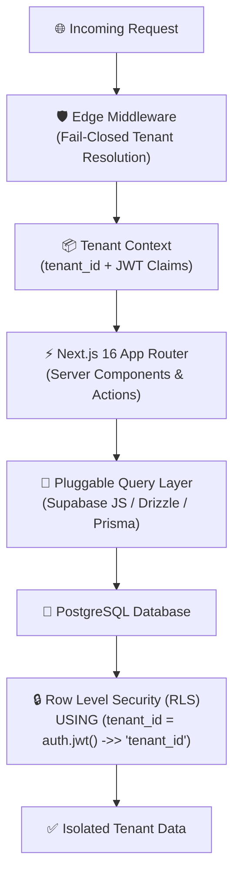
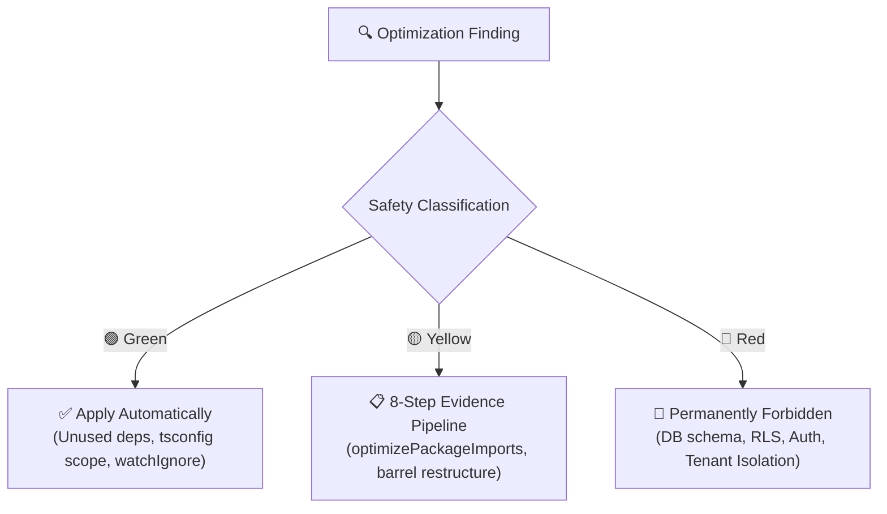

<div align="center">

# ⚡ TidyFactor Next.js `v1.3.0`
### Production-Grade Multi-Tenant SaaS Architecture & Development Performance Engine

**The official multi-tenant architecture and performance optimization track for Next.js 16, React 19, TypeScript Strict, and Supabase within the TidyFactor Ecosystem.**

[](https://www.npmjs.com/package/@alwkala/tidyfactor-next)
[](LICENSE)
[](#-locked-tenant-isolation-model)
[](#-platform-stack--architecture)
[-green.svg?style=for-the-badge)](#-tidyfactor-skill-methodology--governance)

[✨ Ecosystem Hub](https://alwkala.com) • [🔒 Tenant Isolation](#-locked-tenant-isolation-model) • [⚡ 14-Stage Lifecycle](#-14-stage-saas-command-lifecycle) • [🚀 Dev-Perf Engine](#-development-performance--resource-optimization-engine) • [🛡️ RLS & Auth Patterns](#%EF%B8%8F-rls-policy-matrix--auth-hooks) • [📖 بالعربية](README.ar.md)

</div>

---

> [!IMPORTANT]
> **TidyFactor Next.js** is an opinionated, production-grade architectural framework for AI Coding Agents (*Google Antigravity, Claude Code, Cursor, Codex, Windsurf*) and senior fullstack engineers. It enforces **unbreakable tenant isolation** on Next.js 16 and Supabase using PostgreSQL Row Level Security (RLS) as the hard security boundary—blocking data leaks, multi-tenant contamination, and unauthorized cross-tenant access from day one.
>
> In addition, it integrates an **Evidence-Based Development Performance Engine** that diagnoses development environment bottlenecks (RAM pressure, Disk I/O, Dependency Graph, TypeScript scope, File Watch boundaries) and applies verified safe optimizations with before/after DELTA benchmarks.

---

## 🌟 Architectural Value Proposition



| For Fullstack Engineers | For SaaS Founders & CTOs | For AI Coding Agents |
|---|---|---|
| **Locked Tenant Isolation**: Shared schema with `tenant_id` + Postgres RLS. No complex schema-per-tenant migrations or multi-DB connection pooling hell. | **Zero Data-Leak Guarantee**: Hard security boundary at the database layer; application bugs cannot expose Tenant A's data to Tenant B. | **Context-Efficient Dispatcher**: Lightweight `SKILL.md` router loads only ~350 tokens at start, injecting domain memory only on demand. |
| **Pluggable Query Layer**: Choose Supabase JS client, Drizzle ORM, or Prisma once during `init`. All downstream code adheres strictly to your choice. | **Custom JWT Access Token Hook**: Injects verified `tenant_id` and `role` server-side at token issuance—never trusted from client input. | **Deterministic Workflows**: Every command runs against a strict, quantifiable validation checklist before shipping. |
| **Fail-Closed Resolution**: Edge middleware resolves tenant via subdomain, custom domain, or session claim, failing closed (404/403) on error. | **Zero Lock-in Architecture**: Pure Next.js App Router and PostgreSQL standards with zero black-box vendor runtime dependencies. | **100% Architect Score**: Fully compliant (8/8) with the official TidyFactor Skill Architect governance specification. |
| **Evidence-Based Perf Engine**: Diagnoses RAM, CPU, and Disk bottlenecks before touching code; benchmark-backed DELTA verification. | **Predictable Infrastructure Cost**: Identifies bloated client bundles and server secret leaks before deployment. | **SaaS Safety Boundary**: Automatically prohibits performance optimizations that weaken RLS or tenant isolation. |

---

## 🔒 Locked Tenant Isolation Model

`tidyfactor-next` enforces strict, non-negotiable isolation rules across the entire lifecycle:

```sql
-- Standard Tenant Isolation Policy (Pattern 1)
ALTER TABLE public.organizations ENABLE ROW LEVEL SECURITY;

CREATE POLICY "organizations_tenant_isolation_select" ON public.organizations
  FOR SELECT USING (tenant_id = (auth.jwt() ->> 'tenant_id')::uuid);

CREATE POLICY "organizations_tenant_isolation_insert" ON public.organizations
  FOR INSERT WITH CHECK (tenant_id = (auth.jwt() ->> 'tenant_id')::uuid);

CREATE POLICY "organizations_tenant_isolation_update" ON public.organizations
  FOR UPDATE USING (tenant_id = (auth.jwt() ->> 'tenant_id')::uuid)
  WITH CHECK (tenant_id = (auth.jwt() ->> 'tenant_id')::uuid);

CREATE POLICY "organizations_tenant_isolation_delete" ON public.organizations
  FOR DELETE USING (tenant_id = (auth.jwt() ->> 'tenant_id')::uuid);
```

### 🚨 Non-Negotiable Safety Directives:
1. **RLS is the Security Boundary**: Application-layer `WHERE tenant_id = ...` is only a query-plan hint. If RLS is disabled, the system is defective by definition.
2. **`service_role` Key Isolation**: Never exposed to client bundles or public endpoints. Used exclusively in server-only contexts with re-verified tenant context.
3. **Edge Context Propagation**: Tenant identity is resolved once at the edge and passed down—never re-derived haphazardly in deep component trees.
4. **Cross-Tenant Operations Review**: Admin impersonation, cross-tenant migrations, or platform analytics must be isolated and flagged as security review triggers.

---

## ⚡ 14-Stage SaaS Command Lifecycle

The entire SaaS engineering lifecycle is structured into 14 deterministic commands:

| Stage | Command | User Intent | What It Loads | Status |
|---|---|---|---|:---:|
| **1. Foundation** | `init` | Scaffold new multi-tenant project & generate `ARCHITECTURE.md` | `references/workflows/init.md` + `spec.md` + `architecture-doc-skeleton.md` | ✅ **Built** |
| **1. Foundation** | `tenant` | Tenant resolution, context propagation, lifecycle | `references/workflows/tenant.md` + `references/memory/spec.md` | ✅ **Built** |
| **2. Security** | `rls` | RLS policy authoring, 4-policy pattern, leak audit | `references/workflows/rls.md` + `spec.md` + `rls-patterns.md` | ✅ **Built** |
| **2. Security** | `auth` | Supabase Auth, custom JWT claims hook, RBAC/ABAC | `references/workflows/auth.md` + `spec.md` + `auth-patterns.md` | ✅ **Built** |
| **3. Data** | `data` | Schema, migrations, transactions, constraints | `references/commands/data.md` *(planned)* | ⏳ *Roadmap* |
| **3. Data** | `storage` | Tenant-scoped buckets, signed URLs, storage RLS | `references/commands/storage.md` *(planned)* | ⏳ *Roadmap* |
| **4. Application** | `api` | Route handlers, server actions, API contracts | `references/commands/api.md` *(planned)* | ⏳ *Roadmap* |
| **4. Application** | `app` | App Router, React 19, RSC boundaries, Suspense | `references/commands/app.md` *(planned)* | ⏳ *Roadmap* |
| **5. Quality** | `test` | Unit, integration, RLS coverage, E2E security tests | `references/commands/test.md` *(planned)* | ⏳ *Roadmap* |
| **5. Quality** | `observe` | Tracing, tenant-scoped audit logs, health checks | `references/commands/observe.md` *(planned)* | ⏳ *Roadmap* |
| **6. DevOps** | `deploy` | CI/CD, environments, rollback, point-in-time backups | `references/commands/deploy.md` *(planned)* | ⏳ *Roadmap* |
| **6. DevOps / Perf** | `perf` | Development performance audit, bottleneck diagnosis, safe perf | `references/commands/perf.md` + 4 workflows + 5 memory modules | ✅ **Built** |
| **7. Operations** | `incident` | Disaster recovery, tenant leak remediation runbooks | `references/commands/incident.md` *(planned)* | ⏳ *Roadmap* |
| **7. Operations** | `audit` | Full-stack multi-tenant architecture compliance audit | `references/commands/audit.md` *(planned)* | ⏳ *Roadmap* |

---

## 🚀 Development Performance & Resource Optimization Engine

Unlike generic performance advice that focuses solely on Web Vitals or production latency, the `perf` track tackles **development environment friction**: slow dev server startups, sluggish HMR, excessive RAM consumption, and disk I/O bottlenecks.

```
                 Development Environment
                         │
        ┌────────────────┼────────────────┐
        ↓                ↓                ↓
      Memory           CPU            Storage I/O
        │                │                │
        └────────────────┼────────────────┘
                         ↓
              Development Toolchain
                         │
        ┌────────────────┼────────────────┐
        ↓                ↓                ↓
   Dependencies      TypeScript        Bundler
        ↓                ↓                ↓
     Imports           ESLint           Cache
        └────────────────┼────────────────┘
                         ↓
               Developer Experience
```

### 1. Phase 0 Mode Detection & Intent Routing
Before touching a single line of code, the engine identifies developer intent:
- `AUDIT` → 13-Phase comprehensive inspection with a 120-point scorecard.
- `DIAGNOSE` → Bottleneck isolation using 6 causality models.
- `OPTIMIZE` → Automated execution of 🟢 Green-tier optimizations with DELTA tracking.
- `BENCHMARK` → Cold & warm 3-run median measurement.
- `REPORT` → Status inspection with automated staleness checking.

### 2. The 6 Bottleneck Causality Models
- **Model A (RAM Pressure → Disk I/O)**: Memory saturation causes OS swapping to pagefile, degrading HMR and IDE responsiveness.
- **Model B (Large Dependency Graph → CPU/RAM)**: Massive module surfaces cause slow cold starts and heavy type checking.
- **Model C (Slow Storage → Cache I/O)**: Next.js `.next/cache` I/O bottlenecks on slower drives (disabling cache is never recommended).
- **Model D (TypeScript Scope Overreach)**: Broad `include` scopes forcing TypeScript to analyze generated or cache files.
- **Model E (ESLint / Tooling Overhead)**: `typeChecked` rules running across entire codebases without caching.
- **Model F (Watch Boundary Overflow)**: Thousands of media uploads/generated files monitored by the file watcher inside the dev tree.

### 3. Optimization Classification Taxonomy



- **🟢 Green (Safe)**: Unused dependencies removal, `dependencies` vs `devDependencies` correction, `tsconfig.json` scope tightening, `.gitignore` & `watchIgnore` boundary fixes.
- **🟡 Yellow (Review Required)**: Evidence-based `optimizePackageImports` (applied only with barrel import proof), barrel restructuring, client-to-server component conversion.
- **🔴 Red (Forbidden)**: Modifying database schema, RLS policies, auth flows, tenant isolation models, or disabling caching globally.

### 4. Benchmark Noise Control Protocol
Single-run measurements are prone to cache warming and background process noise. The engine mandates:
- **Cold vs. Warm Separation**: Explicit distinction between worst-case cold starts and daily warm restarts.
- **3-Run Median**: Measuring 3 consecutive passes and recording the median.
- **Noise Threshold Rule**: If $\text{Max} - \text{Min} > 20\%$ of median, measurements are re-tested to avoid false improvement claims.

---

## 🛡️ RLS Policy Matrix & Auth Hooks

### 1. `tenant_memberships` Join Model
```sql
CREATE TABLE public.tenant_memberships (
  id uuid PRIMARY KEY DEFAULT gen_random_uuid(),
  tenant_id uuid NOT NULL REFERENCES public.tenants(id) ON DELETE CASCADE,
  user_id uuid NOT NULL REFERENCES auth.users(id) ON DELETE CASCADE,
  role text NOT NULL DEFAULT 'member',
  created_at timestamptz NOT NULL DEFAULT now(),
  UNIQUE (tenant_id, user_id)
);
ALTER TABLE public.tenant_memberships ENABLE ROW LEVEL SECURITY;

CREATE POLICY "memberships_self_select" ON public.tenant_memberships
  FOR SELECT USING (user_id = auth.uid());
```

### 2. Supabase Custom Access Token Hook
```sql
CREATE OR REPLACE FUNCTION public.custom_access_token_hook(event jsonb)
RETURNS jsonb LANGUAGE plpgsql STABLE AS $$
DECLARE
  claims jsonb;
  membership record;
BEGIN
  claims := event->'claims';
  SELECT tenant_id, role INTO membership
  FROM public.tenant_memberships
  WHERE user_id = (event->>'user_id')::uuid
  LIMIT 1;

  IF membership IS NOT NULL THEN
    claims := jsonb_set(claims, '{tenant_id}', to_jsonb(membership.tenant_id));
    claims := jsonb_set(claims, '{role}', to_jsonb(membership.role));
  END IF;
  RETURN event;
END;
$$;
```

---

## 📋 Project Memory & `ARCHITECTURE.md`

During `init`, the skill generates an `ARCHITECTURE.md` file in the project root. This document serves as the **Single Source of Truth** for architectural decisions across agent sessions:
- **Locked Platform Choices**: App Router, React 19, TypeScript strict, Postgres RLS.
- **Chosen Once Decisions**: Query layer (Supabase JS, Drizzle, Prisma), tenant resolution strategy, auth provider, role model.
- **Performance Context**: Known bottlenecks, storage strategy, active baseline, last audit timestamp & git commit SHA.
- **ADR Log**: Append-only register recording significant architectural decisions.
- **Open Risks & Tech Debt**: Prioritized register (P0–P3) tracked across `perf`, `rls`, `audit`, and `incident` commands.

---

## 🚀 Installation & Agent Workspace Setup

### 1. Interactive Project Wizard

```bash
# Launch interactive setup wizard
npx @alwkala/tidyfactor-next
```

### 2. Inject Skill into Existing Next.js Repository

```bash
# Add skill directly to your current project
npx @alwkala/tidyfactor-next add-skill
```

### 3. Manual Agent Copy

Place the skill into your workspace agents directory:
- **Google Antigravity:** `.agents/skills/tidyfactor-next/`
- **Claude Code:** `.claude-skill/skills/tidyfactor-next/`
- **Cursor / Codex / Windsurf:** `.agents/skills/tidyfactor-next/`

---

## 🏛️ TidyFactor Skill Methodology & Governance

`tidyfactor-next` passes all **8 Architectural Governance Rules** under `tidyfactor-skill-architect`:

1. ✅ **Dispatcher Discipline**: `SKILL.md` routes commands without executing tasks (~350 tokens).
2. ✅ **One Workflow = One Outcome**: Every workflow has a single deliverable with an explicit validation checklist.
3. ✅ **Operational Memory**: Pure SQL templates, schemas, and architecture rules—zero narrative prose.
4. ✅ **No Empty Structures**: Clean, flattened architecture without single-file folders.
5. ✅ **Philosophy Isolation**: Technical execution separated from marketing commentary.
6. ✅ **Trigger-Justified Growth**: Commands added per verifiable SaaS lifecycle stages.
7. ✅ **Security & Quality Bar**: Automated RLS coverage queries (`pg_tables`, `pg_policies`) and leak diagnosis.
8. ✅ **Cross-Platform Parity**: 100% identical behavior across Antigravity, Claude Code, Cursor, and Codex.

---


---

## 🏛️ TidyFactor Ecosystem Architecture

**TidyFactor** is a modular web architecture and AI coding agent skill ecosystem built on clear separation of concerns across the product lifecycle:

```
TidyFactor Organization (github.com/TidyFactor)
│
├── Design Skills
│   ├── Cinematic    → Experience / "Wow"     (Apple × Cartier Scroll-Driven Landing Pages)
│   ├── Design       → Prototype / "Build"    (Code-Native UI Design Engine & Figma Alternative)
│   └── Styler       → Production / "Ship"    (Framework Styler & RTL Polish Engine)
│
├── Development Skills
│   ├── HTML         → Content & Static       (Semantic SEO & Static Platform Starter)
│   ├── HTMX         → Hypermedia             (Server-Driven Micro-Interactions)
│   ├── JS           → Vanilla SPA            (Framework-Free Reactive ES Modules)
│   ├── PHP          → Server-Rendered        (Modern PHP 8.x Component UI & Architecture)
│   └── Next         → Multi-Tenant SaaS      (Next.js 16, React 19, Supabase RLS & Dev-Perf)
│
└── Growth Skills
    └── Marketing    → Growth / Revenue       (Direct Response, Pillar SEO & Content Lifecycles)
```

### 💎 Frontend Triad

```
                TidyFactor
                    │
          ┌─────────┼─────────┐
          │         │         │
      Cinematic   Design    Styler
          │         │         │
      Experience Prototype Production
          │         │         │
       "Wow"      "Build"   "Ship"
```

### 📦 Community Package & Skill Parity

| Track | Category | GitHub Repository | Agent Skill | NPM Package |
| :--- | :--- | :--- | :--- | :--- |
| **Cinematic** | Design | [`TidyFactor/Cinematic`](https://github.com/TidyFactor/Cinematic) | `tidyfactor-cinematic` | [`@alwkala/create-cinematic-kit`](https://www.npmjs.com/package/@alwkala/create-cinematic-kit) |
| **Design** | Design | [`TidyFactor/Design`](https://github.com/TidyFactor/Design) | `tidyfactor-design` | [`@alwkala/tidyfactor-design`](https://www.npmjs.com/package/@alwkala/tidyfactor-design) |
| **Styler** | Design | [`TidyFactor/Styler`](https://github.com/TidyFactor/Styler) | `tidyfactor-styler` | [`@alwkala/tidyfactor-styler`](https://www.npmjs.com/package/@alwkala/tidyfactor-styler) |
| **Next** | Development | [`TidyFactor/Next`](https://github.com/TidyFactor/Next) | `tidyfactor-next` | [`@alwkala/tidyfactor-next`](https://www.npmjs.com/package/@alwkala/tidyfactor-next) |
| **HTML** | Development | [`TidyFactor/HTML`](https://github.com/TidyFactor/HTML) | `tidyfactor-html` | [`@alwkala/tidyfactor-html`](https://www.npmjs.com/package/@alwkala/tidyfactor-html) |
| **HTMX** | Development | [`TidyFactor/HTMX`](https://github.com/TidyFactor/HTMX) | `tidyfactor-htmx` | [`@alwkala/tidyfactor-htmx`](https://www.npmjs.com/package/@alwkala/tidyfactor-htmx) |
| **JS** | Development | [`TidyFactor/JS`](https://github.com/TidyFactor/JS) | `tidyfactor-js` | [`@alwkala/tidyfactor-js`](https://www.npmjs.com/package/@alwkala/tidyfactor-js) |
| **PHP** | Development | [`TidyFactor/PHP`](https://github.com/TidyFactor/PHP) | `tidyfactor-php` | [`@alwkala/tidyfactor-php`](https://www.npmjs.com/package/@alwkala/tidyfactor-php) |
| **Marketing** | Growth | [`TidyFactor/Marketing`](https://github.com/TidyFactor/Marketing) | `tidyfactor-marketing` | [`@alwkala/tidyfactor-marketing`](https://www.npmjs.com/package/@alwkala/tidyfactor-marketing) |

---

## 👨‍💻 Organization & Support

- 🌐 **Official Website:** [https://tidyfactor.com/](https://tidyfactor.com/)
- 📚 **Official Documentation:** [https://tidyfactor.com/documentation](https://tidyfactor.com/documentation)
- 🤝 **Official Partner Website:** [Alwkala Digital Agency](https://alwkala.com/)
- 🐙 **GitHub Organization:** [github.com/TidyFactor](https://github.com/TidyFactor)
- 📧 **Business Inquiries:** [hello@tidyfactor.com](mailto:hello@tidyfactor.com)
- 📱 **WhatsApp:** [+20 101 665 6899](https://wa.me/201016656899)
- 📞 **Phone:** +20 101 665 6899
- 📍 **Location:** Cairo, Egypt

---

## 📜 License

Licensed under the **Apache License 2.0**. Copyright (c) 2026 [TidyFactor](https://tidyfactor.com) & [Alwkala](https://alwkala.com).
